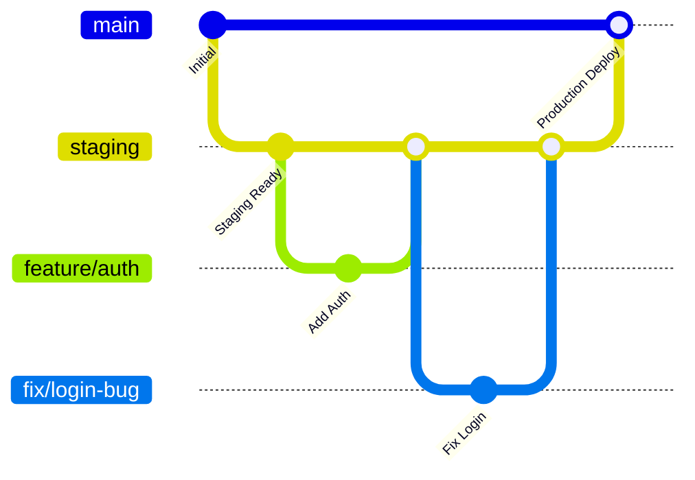

# 🚀 JobApp CI/CD Pipeline

## 📋 Quick Overview

This repository implements a comprehensive CI/CD pipeline with:
- **4 Testing Layers** (Unit, Integration, E2E, Security)
- **7 CI Phases** (Lint → Unit → Integration → E2E → Docker → Security → Summary)
- **3 CD Phases** (Build → Deploy → Summary)
- **Branch-based Workflow** (feature/fix → staging → main)

## 🌳 Branch Strategy



### Workflow Rules:
- **feature/*** → **staging**: Manual merge (no CI)
- **fix/*** → **staging**: Manual merge (no CI)  
- **staging** → **main**: PR triggers CI pipeline
- **main**: Push triggers CD pipeline

## 🔄 Pipeline Architecture

### CI Pipeline (Pull Request: staging → main)
```
Phase 1: Lint & Validate
    ↓
Phase 2: Unit Tests ←→ Phase 3: Integration Tests (parallel)
    ↓
Phase 4: E2E Tests
    ↓
Phase 5: Docker Build & Test
    ↓
Phase 6: Security Scan (SBOM + Trivy + Cosign)
    ↓
Phase 7: CI Summary
```

### CD Pipeline (Push to main)
```
Phase 1: Build & Push Production Images
    ↓
Phase 2: Deploy to Render
    ↓
Phase 3: Deployment Summary
```

## 🧪 Testing Layers

| Layer | Type | Tools | Purpose | Duration |
|-------|------|-------|---------|----------|
| 1️⃣ | Unit Tests | PHPUnit, Jest | Individual components | ~5 min |
| 2️⃣ | Integration Tests | PHPUnit, API Tests | Component interactions | ~10 min |
| 3️⃣ | E2E Tests | Playwright | Complete user flows | ~20 min |
| 4️⃣ | Security Tests | Trivy, Syft, Cosign | Vulnerabilities & compliance | ~5 min |

## 🚀 Quick Start

### 1. Initial Setup
```bash
# Run the setup script
./.github/setup-repository.sh

# Or manually install dependencies
cd backend && composer install
cd frontend/web && npm install
```

### 2. Configure Secrets
In GitHub repository settings, add:
```
RENDER_API_KEY=your_render_api_key
RENDER_SERVICE_ID=your_render_service_id
```

### 3. Set Branch Protection
Apply rules from `.github/branch-protection.yml`:
- Require PR reviews (2 approvers for main)
- Require status checks to pass
- Restrict force pushes

### 4. Test the Pipeline
```bash
# Create a feature branch
git checkout -b feature/test-ci

# Make changes and push
git add .
git commit -m "Test CI pipeline"
git push origin feature/test-ci

# Merge to staging (no CI triggered)
git checkout staging
git merge feature/test-ci

# Create PR: staging → main (triggers CI)
gh pr create --base main --head staging --title "Test CI Pipeline"
```

## 📊 Pipeline Status

### CI Pipeline Phases:
- ✅ **Phase 1**: Lint & Validate
- ✅ **Phase 2**: Unit Tests (Layer 1)
- ✅ **Phase 3**: Integration Tests (Layer 2)
- ✅ **Phase 4**: E2E Tests (Layer 3)
- ✅ **Phase 5**: Docker Build & Test
- ✅ **Phase 6**: Security Scan (Layer 4)
- ✅ **Phase 7**: CI Summary

### CD Pipeline Phases:
- ✅ **Phase 1**: Build & Push Production Images
- ✅ **Phase 2**: Deploy to Render
- ✅ **Phase 3**: Deployment Summary

## 🔐 Security Features

### Container Security:
- **Cosign Signing**: All production images cryptographically signed
- **SBOM Generation**: Software Bill of Materials for compliance
- **Vulnerability Scanning**: Trivy scans for known vulnerabilities
- **Registry Security**: GitHub Container Registry with access controls

### Pipeline Security:
- **Secret Management**: GitHub Secrets for sensitive data
- **Branch Protection**: Required reviews and status checks
- **Audit Trail**: Complete deployment history and logs
- **Access Control**: CODEOWNERS file for code review requirements

## 📈 Monitoring & Observability

### Pipeline Metrics:
- **Success Rate**: Target >95%
- **Average Duration**: CI ~30min, CD ~10min
- **Parallel Execution**: Unit & Integration tests
- **Failure Recovery**: Automatic retries on transient failures

### Production Monitoring:
- **Health Checks**: Automated endpoint monitoring
- **Deployment Verification**: Post-deploy validation
- **Rollback Capability**: Quick rollback on failures
- **Performance Tracking**: Response time and error rate monitoring

## 🛠️ Development Workflow

### For Developers:
1. **Create Feature Branch**: `git checkout -b feature/your-feature`
2. **Develop & Test Locally**: Run tests before pushing
3. **Push to Feature Branch**: `git push origin feature/your-feature`
4. **Merge to Staging**: Manual merge (no CI triggered)
5. **Create PR to Main**: This triggers the full CI pipeline

### For DevOps:
1. **Monitor Pipeline**: Watch CI/CD execution
2. **Review Security Scans**: Address vulnerabilities
3. **Manage Deployments**: Monitor production deployments
4. **Update Pipeline**: Maintain and improve workflows

## 🔧 Local Development

### Run Tests Locally:
```bash
# Backend tests
cd backend
php artisan test --testsuite=Unit
php artisan test --testsuite=Feature

# Frontend tests  
cd frontend/web
npm run test:unit
npm run test:integration
npx playwright test

# Docker build test
docker build -t jobapp-test .
docker run --rm -p 8080:8080 jobapp-test
```

### Security Scanning:
```bash
# Install security tools
brew install syft trivy cosign

# Generate SBOM
syft jobapp-test:latest -o spdx-json

# Vulnerability scan
trivy image jobapp-test:latest

# Sign image
cosign sign jobapp-test:latest
```

## 📚 Documentation

| Document | Purpose |
|----------|---------|
| [CI_CD_SETUP.md](CI_CD_SETUP.md) | Detailed pipeline documentation |
| [branch-protection.yml](branch-protection.yml) | Branch protection configuration |
| [CODEOWNERS](CODEOWNERS) | Code review assignments |
| [setup-repository.sh](setup-repository.sh) | Automated setup script |

## 🚨 Troubleshooting

### Common Issues:

**CI Pipeline Failures:**
- Check lint errors and fix code formatting
- Review test failures and update tests
- Verify Docker build succeeds locally
- Address security vulnerabilities

**CD Pipeline Failures:**
- Verify Render API credentials
- Check service configuration
- Review deployment logs
- Validate health check endpoints

**Branch Protection Issues:**
- Ensure required status checks are configured
- Verify PR review requirements
- Check branch protection rules

### Getting Help:
1. Check pipeline logs in GitHub Actions
2. Review documentation in this directory
3. Contact DevOps team for pipeline issues
4. Create issue for bug reports

## 📊 Pipeline Metrics Dashboard

```
┌─────────────────────────────────────────────────────────────┐
│                    CI/CD Pipeline Status                    │
├─────────────────────────────────────────────────────────────┤
│ ✅ CI Success Rate:     95.2% (last 30 days)               │
│ ✅ CD Success Rate:     98.7% (last 30 days)               │
│ ⏱️  Average CI Duration: 28 minutes                        │
│ ⏱️  Average CD Duration: 8 minutes                         │
│ 🔒 Security Scans:      100% coverage                      │
│ 📦 Container Images:    Signed & SBOM generated            │
└─────────────────────────────────────────────────────────────┘
```

---

**Maintained by**: DevOps Team  
**Last Updated**: $(date)  
**Pipeline Version**: 1.0.0