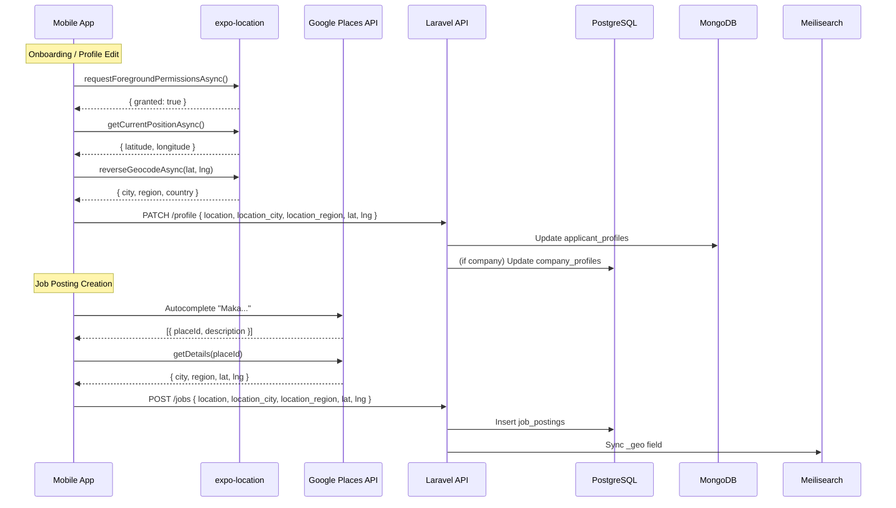

# Location Detection & Geocoding — Engineering Analysis

> **Scope**: JobSwipe mobile app (Expo/React Native) + Laravel backend  
> **Date**: 2026-04-23

---

## 1. Current State ("As-Is")

### 1.1 Data Schema

| Entity | Store | Location Fields | Coordinates |
|---|---|---|---|
| **JobPosting** | PostgreSQL | `location` (free-text, 255), `location_city` (100), `location_region` (100) | `lat` DECIMAL(9,6), `lng` DECIMAL(9,6) |
| **ApplicantProfile** | MongoDB | `location` (free-text), `location_city`, `location_region` | ❌ **None** |
| **CompanyProfile** | PostgreSQL | ❌ **None** | ❌ **None** |

> [!WARNING]
> The applicant profile has **no lat/lng** fields, and the company profile has **no location fields at all**. This limits the system to naive string matching (`strtolower` city comparison) for proximity features.

### 1.2 Backend Usage

- **DeckService** ([DeckService.php](file:///Users/apple/Desktop/DevWork/Project/JobSwipe/JobSwipe/backend/app/Services/DeckService.php#L146-L155)): Awards a `+0.1` relevance bonus when `job.location_city === applicant.location_city` (case-insensitive string match).
- **Meilisearch index** ([JobPosting.php](file:///Users/apple/Desktop/DevWork/Project/JobSwipe/JobSwipe/backend/app/Models/PostgreSQL/JobPosting.php#L94-L108)): The `_geo` field (`lat`/`lng`) is indexed, which means Meilisearch's `_geoRadius` and `_geoSort` filters are **already supported at the search layer** — but nothing populates `lat`/`lng` today.
- **Request validation** ([CreateJobPostingRequest.php](file:///Users/apple/Desktop/DevWork/Project/JobSwipe/JobSwipe/backend/app/Http/Requests/Company/CreateJobPostingRequest.php#L21-L23)): `location_city` and `location_region` are nullable; the frontend must submit them explicitly.

### 1.3 Frontend Usage

- `expo-location` is **installed** (`~19.0.8` in [package.json](file:///Users/apple/Desktop/DevWork/Project/JobSwipe/JobSwipe/frontend/mobile/package.json)) but **never imported or used**.
- All location strings in the app are **hardcoded mock data** (e.g., `'San Francisco, CA · Remote'`).
- The profile screen shows `"San Francisco, CA"` as a static label — no detection, no editing.

### 1.4 .env / Third-party Services

- **No geocoding API key** (Google Maps, Mapbox, etc.) is configured in `.env`.
- No geocoding or Places service exists in the backend.

---

## 2. Identified Gaps

| # | Gap | Impact |
|---|---|---|
| 1 | `expo-location` installed but unused | Users can't share their GPS location |
| 2 | No reverse-geocoding on mobile | Even if GPS coords are captured, they can't be resolved to city/region |
| 3 | No backend geocoding service | `lat`/`lng` on job postings is never populated → Meilisearch `_geo` always `null` |
| 4 | Company profile has no address fields | Company HQ location can't be stored or searched |
| 5 | Applicant profile has no `lat`/`lng` | Distance-based deck sorting is impossible |
| 6 | DeckService uses string-match only | "Makati" ≠ "Makati City" → missed matches |
| 7 | No location autocomplete UX | Users must type free-text → inconsistent data quality |

---

## 3. Recommended Architecture

### 3.1 High-Level Data Flow



### 3.2 Strategy by Persona

#### Applicant (Job Seeker)

| Method | When | How |
|---|---|---|
| **GPS auto-detect** | Onboarding step 1 / Profile edit | `expo-location` → `getCurrentPositionAsync()` → `reverseGeocodeAsync()` |
| **Manual entry** | Fallback or correction | Free-text input with optional autocomplete |
| **Background refresh** | App foregrounded after 24h+ | Silent GPS update → PATCH to backend |

#### Company (HR / Admin)

| Method | When | How |
|---|---|---|
| **Places Autocomplete** | Job posting creation | Google Places / Mapbox Search → structured city/region/coords |
| **Company HQ address** | Company profile onboarding | Same autocomplete UX; stored on `company_profiles` |
| **Manual override** | "Remote" work type | Skip location; set `lat`/`lng` to `null` |

---

## 4. Implementation Plan

### 4.1 Frontend (Mobile)

#### A. Location Hook — `useLocation.ts`

```typescript
// hooks/useLocation.ts
import * as Location from 'expo-location';
import { useState, useCallback } from 'react';

export interface ResolvedLocation {
  latitude: number;
  longitude: number;
  city: string | null;
  region: string | null;
  country: string | null;
  formattedAddress: string;          // "Makati, Metro Manila, PH"
}

export function useLocation() {
  const [location, setLocation] = useState<ResolvedLocation | null>(null);
  const [loading, setLoading]   = useState(false);
  const [error, setError]       = useState<string | null>(null);

  const detectLocation = useCallback(async () => {
    setLoading(true);
    setError(null);
    try {
      // 1. Request permission
      const { status } = await Location.requestForegroundPermissionsAsync();
      if (status !== 'granted') {
        setError('Location permission denied');
        return null;
      }

      // 2. Get GPS coordinates
      const pos = await Location.getCurrentPositionAsync({
        accuracy: Location.Accuracy.Balanced,   // ~100m, fast
      });

      // 3. Reverse-geocode to human-readable address
      const [geo] = await Location.reverseGeocodeAsync({
        latitude:  pos.coords.latitude,
        longitude: pos.coords.longitude,
      });

      const resolved: ResolvedLocation = {
        latitude:  pos.coords.latitude,
        longitude: pos.coords.longitude,
        city:    geo?.city ?? geo?.subregion ?? null,
        region:  geo?.region ?? null,
        country: geo?.isoCountryCode ?? null,
        formattedAddress: [geo?.city, geo?.region, geo?.isoCountryCode]
          .filter(Boolean)
          .join(', '),
      };

      setLocation(resolved);
      return resolved;
    } catch (e: any) {
      setError(e.message ?? 'Location detection failed');
      return null;
    } finally {
      setLoading(false);
    }
  }, []);

  return { location, loading, error, detectLocation };
}
```

> [!NOTE]
> `expo-location`'s built-in `reverseGeocodeAsync()` uses **Apple's MapKit** on iOS and **Android's Geocoder** on Android — **no extra API key required** for this basic usage.

#### B. Location Autocomplete Component

For the **job posting form** (company side), a Google Places or Mapbox autocomplete is needed for structured results:

```typescript
// components/LocationAutocomplete.tsx  (simplified)
import React, { useState } from 'react';
import { TextInput, FlatList, TouchableOpacity, Text, View } from 'react-native';

const GOOGLE_PLACES_API_KEY = process.env.EXPO_PUBLIC_GOOGLE_PLACES_KEY;

interface Prediction {
  place_id: string;
  description: string;
}

interface Props {
  onSelect: (location: {
    address: string;
    city: string;
    region: string;
    lat: number;
    lng: number;
  }) => void;
}

export function LocationAutocomplete({ onSelect }: Props) {
  const [query, setQuery]             = useState('');
  const [predictions, setPredictions] = useState<Prediction[]>([]);

  const search = async (text: string) => {
    setQuery(text);
    if (text.length < 3) { setPredictions([]); return; }

    const url = `https://maps.googleapis.com/maps/api/place/autocomplete/json`
      + `?input=${encodeURIComponent(text)}`
      + `&types=(cities)`
      + `&key=${GOOGLE_PLACES_API_KEY}`;

    const res = await fetch(url);
    const json = await res.json();
    setPredictions(json.predictions ?? []);
  };

  const select = async (placeId: string, description: string) => {
    const url = `https://maps.googleapis.com/maps/api/place/details/json`
      + `?place_id=${placeId}`
      + `&fields=geometry,address_components`
      + `&key=${GOOGLE_PLACES_API_KEY}`;

    const res  = await fetch(url);
    const json = await res.json();
    const loc  = json.result.geometry.location;
    const components = json.result.address_components;

    const city   = components.find((c: any) => c.types.includes('locality'))?.long_name ?? '';
    const region = components.find((c: any) => c.types.includes('administrative_area_level_1'))?.long_name ?? '';

    onSelect({ address: description, city, region, lat: loc.lat, lng: loc.lng });
    setQuery(description);
    setPredictions([]);
  };

  return (
    <View>
      <TextInput value={query} onChangeText={search} placeholder="Search city..." />
      <FlatList
        data={predictions}
        keyExtractor={(p) => p.place_id}
        renderItem={({ item }) => (
          <TouchableOpacity onPress={() => select(item.place_id, item.description)}>
            <Text>{item.description}</Text>
          </TouchableOpacity>
        )}
      />
    </View>
  );
}
```

> [!TIP]
> **Free alternative**: Use `expo-location`'s `geocodeAsync(address)` for forward geocoding instead of Google Places. Trade-off: no autocomplete suggestions, but zero cost.

#### C. Integration Points

| Screen | Action | Implementation |
|---|---|---|
| **Applicant Onboarding** (Step 1 — Basic Info) | "Detect my location" button | Call `useLocation().detectLocation()` → pre-fill city/region fields |
| **Applicant Profile Edit** | Edit location field | Show current location + "Re-detect" button |
| **Job Posting Form** (Company) | Location input | `<LocationAutocomplete />` with structured output |
| **Swipe Deck / Job Detail** | Display distance badge | Calculate Haversine from cached applicant coords vs job `lat`/`lng` |

---

### 4.2 Backend (Laravel)

#### A. Schema Changes

**Migration: Add coordinates to applicant profiles (MongoDB)**

Update [ApplicantProfileDocument.php](file:///Users/apple/Desktop/DevWork/Project/JobSwipe/JobSwipe/backend/app/Models/MongoDB/ApplicantProfileDocument.php) `$fillable`:

```php
// Add to $fillable array:
'lat',
'lng',
```

Create a `2dsphere` index via [MongoSetup.php](file:///Users/apple/Desktop/DevWork/Project/JobSwipe/JobSwipe/backend/app/Console/Commands/MongoSetup.php):

```php
$database->applicant_profiles->createIndex(
    ['coordinates' => '2dsphere']  // for $near queries
);
```

**Migration: Add location fields to company_profiles (PostgreSQL)**

```php
Schema::table('company_profiles', function (Blueprint $table) {
    $table->string('hq_address', 255)->nullable();
    $table->string('hq_city', 100)->nullable();
    $table->string('hq_region', 100)->nullable();
    $table->decimal('hq_lat', 9, 6)->nullable();
    $table->decimal('hq_lng', 9, 6)->nullable();
});
```

#### B. Geocoding Service (Server-Side)

For cases where the frontend sends only a free-text address (e.g., legacy data, web dashboard):

```php
// app/Services/GeocodingService.php
namespace App\Services;

use Illuminate\Support\Facades\Http;
use Illuminate\Support\Facades\Cache;

class GeocodingService
{
    private string $apiKey;

    public function __construct()
    {
        $this->apiKey = config('services.google_maps.key');
    }

    /**
     * Forward geocode: address string → lat/lng + structured components
     */
    public function geocode(string $address): ?array
    {
        $cacheKey = 'geo:' . md5($address);

        return Cache::remember($cacheKey, 86400, function () use ($address) {
            $response = Http::get('https://maps.googleapis.com/maps/api/geocode/json', [
                'address' => $address,
                'key'     => $this->apiKey,
            ]);

            if (!$response->ok()) return null;

            $result = $response->json('results.0');
            if (!$result) return null;

            $components = collect($result['address_components']);

            return [
                'lat'    => $result['geometry']['location']['lat'],
                'lng'    => $result['geometry']['location']['lng'],
                'city'   => $components->firstWhere(
                    fn($c) => in_array('locality', $c['types'])
                )['long_name'] ?? null,
                'region' => $components->firstWhere(
                    fn($c) => in_array('administrative_area_level_1', $c['types'])
                )['long_name'] ?? null,
            ];
        });
    }
}
```

> [!IMPORTANT]
> Cache geocoding results aggressively (24h+). Google's Geocoding API costs **$5 / 1,000 requests** after the free tier. For JobSwipe's scale, this is manageable but must be monitored.

#### C. Enhanced DeckService — Distance Scoring

Replace the current string-match `calculateLocationBonus()` with Haversine distance:

```php
private function calculateLocationBonus(JobPosting $job, ?ApplicantProfileDocument $profile): float
{
    if (!$profile || !$profile->lat || !$job->lat) {
        // Fallback to city string match
        if ($profile?->location_city && $job->location_city) {
            return strtolower($job->location_city) === strtolower($profile->location_city)
                ? 0.10 : 0.0;
        }
        return 0.0;
    }

    $distanceKm = $this->haversine(
        $profile->lat, $profile->lng,
        $job->lat, $job->lng
    );

    return match (true) {
        $distanceKm <= 10  => 0.15,   // Same city core
        $distanceKm <= 30  => 0.10,   // Metro area
        $distanceKm <= 100 => 0.05,   // Regional
        default            => 0.00,
    };
}

private function haversine(float $lat1, float $lng1, float $lat2, float $lng2): float
{
    $R = 6371; // Earth radius in km
    $dLat = deg2rad($lat2 - $lat1);
    $dLng = deg2rad($lng2 - $lng1);
    $a = sin($dLat / 2) ** 2
       + cos(deg2rad($lat1)) * cos(deg2rad($lat2)) * sin($dLng / 2) ** 2;

    return $R * 2 * atan2(sqrt($a), sqrt(1 - $a));
}
```

#### D. API Contract Updates

**PATCH `/api/v1/profile/basic-info`** — add `lat`, `lng`:

```diff
 'location'        => ['required', 'string', 'max:255'],
 'location_city'   => ['nullable', 'string', 'max:100'],
 'location_region' => ['nullable', 'string', 'max:100'],
+'lat'             => ['nullable', 'numeric', 'between:-90,90'],
+'lng'             => ['nullable', 'numeric', 'between:-180,180'],
```

**POST `/api/v1/jobs`** — add `lat`, `lng` validation:

```diff
 'location'        => ['required_if:work_type,hybrid,on_site', 'nullable', 'string', 'max:255'],
 'location_city'   => ['nullable', 'string', 'max:100'],
 'location_region' => ['nullable', 'string', 'max:100'],
+'lat'             => ['nullable', 'numeric', 'between:-90,90'],
+'lng'             => ['nullable', 'numeric', 'between:-180,180'],
```

---

## 5. Decision Matrix — Geocoding Provider

| Criteria | Google Maps Platform | Mapbox | expo-location (built-in) |
|---|---|---|---|
| **Autocomplete** | ✅ Places API | ✅ Search API | ❌ None |
| **Reverse Geocode** | ✅ Geocoding API | ✅ Reverse Geocoding | ✅ Free (OS-native) |
| **Forward Geocode** | ✅ Geocoding API | ✅ Forward Geocoding | ✅ Free (OS-native) |
| **Cost** | $2-5/1K reqs (free $200/mo) | $0.75/1K reqs (free 100K/mo) | Free |
| **Accuracy** | Excellent | Very Good | Good (varies by device/region) |
| **Structured Data** | Excellent (address components) | Good | Basic (city/region only) |
| **Offline** | ❌ | ❌ | ✅ (on-device geocoder) |

### Recommended Approach

```
┌──────────────────────────────────────────────────────────────────┐
│  Applicant Location     → expo-location (FREE, on-device)       │
│  Company Job Location   → Google Places Autocomplete (PAID)     │
│  Backend Fallback       → Google Geocoding API (PAID, cached)   │
└──────────────────────────────────────────────────────────────────┘
```

> [!TIP]
> This hybrid approach keeps applicant-side costs at **$0** (device-native geocoding) while investing in high-quality structured data for job postings via Google Places (the $200/month free credit easily covers early-stage usage).

---

## 6. Privacy & UX Considerations

| Concern | Mitigation |
|---|---|
| **Permission fatigue** | Only request location during onboarding, never on first launch. Show clear value prop: *"Find jobs near you"*. |
| **Denied permission** | Graceful fallback to manual text entry. Never block the user. |
| **Location precision** | Use `Accuracy.Balanced` (~100m), not `Accuracy.Highest`. Sufficient for city-level matching; preserves battery. |
| **Data storage** | Store coordinates rounded to 3 decimal places (~111m precision) to limit PII exposure. Never expose raw coords to other users. |
| **GDPR / Privacy** | Show distance labels ("~5 km away") instead of exact addresses. Allow users to disable location sharing. |
| **Stale location** | Refresh GPS silently on app foregrounding if last update > 24h. Don't prompt user. |

---

## 7. Implementation Checklist

### Phase 1 — Foundation (Backend)
- [ ] Add `lat`, `lng` to `ApplicantProfileDocument` fillable
- [ ] Add `hq_address`, `hq_city`, `hq_region`, `hq_lat`, `hq_lng` to `company_profiles` migration
- [ ] Update `UpdateApplicantBasicInfoRequest` validation to accept `lat`, `lng`
- [ ] Update `CreateJobPostingRequest` validation to accept `lat`, `lng`
- [ ] Add `GOOGLE_MAPS_KEY` to `.env` + `config/services.php`
- [ ] Create `GeocodingService` with caching

### Phase 2 — Frontend Core
- [ ] Create `useLocation` hook
- [ ] Integrate location detection into applicant onboarding
- [ ] Add "Detect Location" button to profile edit screen
- [ ] Update profile PATCH call to include `lat`, `lng`

### Phase 3 — Company Job Posting
- [ ] Add `EXPO_PUBLIC_GOOGLE_PLACES_KEY` to mobile `.env`
- [ ] Create `LocationAutocomplete` component
- [ ] Integrate into job posting creation form
- [ ] Send structured `location_city`, `location_region`, `lat`, `lng` to backend

### Phase 4 — Proximity Features
- [ ] Upgrade `DeckService.calculateLocationBonus()` to Haversine
- [ ] Add distance badge to job cards (client-side Haversine)
- [ ] Enable Meilisearch `_geoRadius` filtering for "jobs within X km"
- [ ] Add "distance" sort option to deck settings

---

## 8. Summary

The codebase has **strong schema foundations** (lat/lng columns on `job_postings`, `_geo` in Meilisearch, `expo-location` installed) but **zero runtime implementation**. The recommended path forward is:

1. **Applicant location** → On-device GPS + OS-native reverse geocoding (free)
2. **Job location** → Google Places Autocomplete for structured city/region/coords
3. **Backend** → Accept and validate coordinates, upgrade DeckService to Haversine, enable Meilisearch geo-filters
4. **Privacy** → City-level precision, distance labels, graceful permission fallbacks
