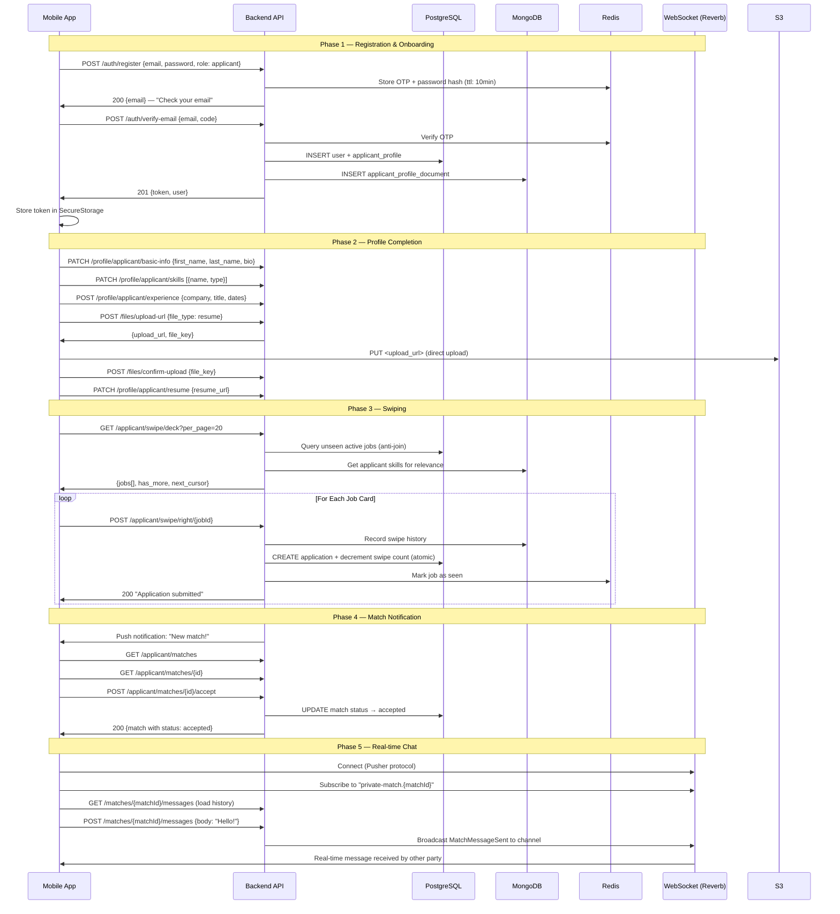
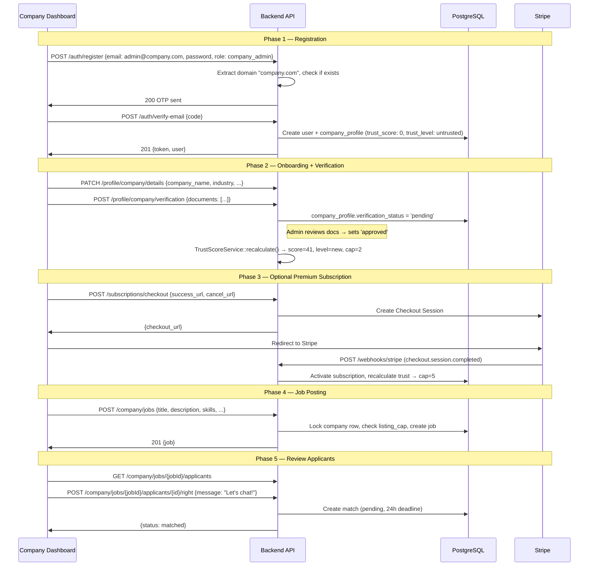
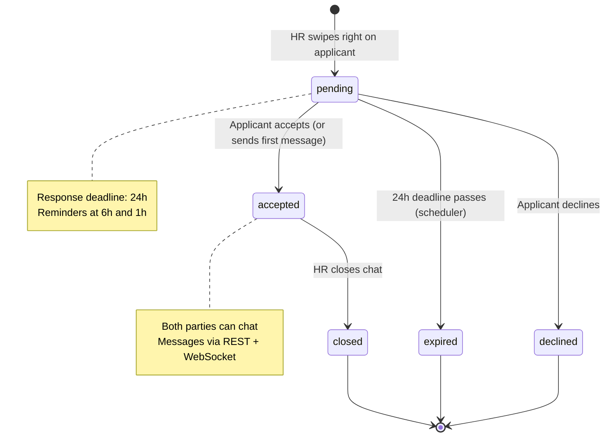

# JobSwipe — Codebase Review & API Testing Guide

> **Reviewer:** Senior SWE Audit  
> **Scope:** Full backend (`backend/`) — architecture, code quality, security, production readiness  
> **Date:** 2026-04-14  

---

## Part 1 — Codebase Critique

### 1.1 Overall Quality Rating: **A-** (Strong, Approaching Production-Grade)

The codebase is **well above average** for a startup project. There is a clear architectural vision, separation of concerns, and thoughtful handling of edge cases. With the recent fixes to transactional integrity and dependency injection, the main remaining gap to full production readiness is **automated test coverage** and a few medium-priority improvements.

---

### 1.2 What's Good ✅

#### Architecture & Design Patterns

| Strength | Evidence |
|---|---|
| **Clean layered architecture** | Controller → Service → Repository pattern is used consistently. Controllers are thin, services handle orchestration, repositories encapsulate queries. This is textbook Laravel best practice. |
| **Polyglot persistence done right** | PostgreSQL for relational/transactional data, MongoDB for flexible documents (profiles, swipe history, reviews), Redis for ephemeral caching (OTP, swipe locks, trust scores). Each data store serves its natural purpose. |
| **Consistent API response envelope** | The `ApiResponse` trait (`success()` / `error()` / `validationError()`) gives every endpoint a uniform `{success, data, message, code}` shape. Mobile devs will love this. |
| **Typed error codes** | Errors surface machine-readable codes like `EMAIL_TAKEN`, `SWIPE_LIMIT_REACHED`, `IDEMPOTENCY_KEY_IN_PROGRESS`. This is critical for mobile apps that branch UI logic on error types. |
| **UUID primary keys** | All models use `Str::uuid()` via boot hooks, preventing enumeration attacks and making multi-tenant DB merges trivial. |
| **Idempotency across payment flows** | Both Stripe checkout and IAP purchases use idempotency-key reservation with fingerprint validation, in-progress detection, and cached-result replay. This prevents double charges — a make-or-break concern for a payments app. |
| **Webhook signature verification on all channels** | Stripe uses `Webhook::constructEvent()` with `Stripe-Signature` header validation. Apple uses a dedicated `AppleWebhookVerifierService` for JWS/certificate verification. Google uses `GooglePubSubWebhookVerifierService` for OIDC token validation. All three payment webhook endpoints reject unsigned/invalid payloads. |
| **ReviewService transactional integrity** | Review creation wraps PG operations in `DB::beginTransaction()`/`commit()` with proper MongoDB cleanup on rollback. Side-effects (notifications, trust recalculation) are isolated outside the transaction with individual try-catch guards so they can't break the core write path. |
| **Atomic swipe consumption** | `SwipeService::consumeApplicantSwipeAtomically()` uses `lockForUpdate()` inside a transaction, preventing TOCTOU races where two concurrent swipes could both pass the limit check. The middleware is advisory-only, which is the correct design. |
| **Trust Score Engine** | A well-designed, config-driven scoring system (`config/trust.php`) with weighted components (email domain, verification, age, reviews, behavioral, subscription) that drives listing caps and deck visibility. This is a sophisticated feature that most startups skip. |
| **Cursor-based pagination on the deck** | `DeckService` uses `(published_at, id)` keyset pagination instead of offset-based pagination. This is correct for infinite-scroll UIs and avoids drift when new jobs are published. |
| **Comprehensive scheduled jobs** | Match expiry, swipe reset, subscription expiry, Stripe webhook retries, trust score refresh, match reminders — all scheduled with `withoutOverlapping()`. |

#### Code Quality

- **PHP 8.2 features**: Constructor promotion, named arguments, `match` expressions, `?->` nullsafe operators, readonly properties — all used idiomatically.
- **Consistent code style**: `pint.json` enforces formatting. The code reads consistently across all 20+ services.
- **Thoughtful comments**: Non-obvious decisions are documented inline (e.g., the advisory swipe middleware, the Render route-cache workaround).
- **Form Request classes**: Validation is extracted to dedicated request classes (`RegisterRequest`, `CreateJobPostingRequest`, `SendMatchMessageRequest`), keeping controllers clean.

#### DevOps

- Docker Compose with healthchecks for Postgres, MongoDB, Redis.
- Dockerfile for Render deployment with Nginx + PHP-FPM + Supervisor.
- Separate Horizon worker mode (`RUN_HORIZON=true`) for queue processing.

---

### 1.3 What's Bad / Needs Work ❌

#### 🔴 Critical — Test Coverage Is Nearly Zero

> [!CAUTION]
> The `tests/Feature/` directory contains only a `.gitkeep`. The `tests/Unit/` directory has a couple of exploratory tests. **There are no automated tests for any endpoint, service, or critical path.** For a payments-handling application (Stripe, Apple IAP, Google Play), this is a **blocking production issue**.

**Impact:**
- Every deployment is a manual regression gamble.
- The match state machine (pending → accepted/declined/expired/closed) has at least 20 edge cases that are currently verified only by code-reading.
- IAP webhook handling bugs can silently eat money.

**Recommendation:** Before launch, you need at the absolute minimum:
1. Auth flow tests (register → OTP → verify → login → logout)
2. Swipe idempotency + limit exhaustion tests
3. Match lifecycle state-machine tests (all transitions)
4. Stripe webhook event replay / idempotency tests
5. IAP purchase + webhook tests (mocked validators)

---

> [!NOTE]
> **Previously identified issues now resolved:**
> - ~~Stripe webhook signature verification~~ → **Fixed.** `Webhook::constructEvent()` with `Stripe-Signature` header is implemented in `SubscriptionController::handleWebhook()`. Apple and Google webhooks also have dedicated verifier services.
> - ~~ReviewService lacks transactional integrity~~ → **Fixed.** Now uses `DB::beginTransaction()`/`commit()`/`rollBack()` with proper cross-database compensation (MongoDB cleanup on PG rollback). Side-effects (notifications, trust recalculation) are isolated outside the transaction.
> - ~~Hidden dependencies via `app()` container calls~~ → **Fixed.** `TrustScoreService` registered as singleton and injected via constructor DI everywhere; `app()` container calls removed.
> - ~~Eager loading during locked queries~~ → **Fixed.** `findByIdOrFailForUpdate()` now chains `->with(['applicant'])` on the same locked query, co-fetching the relationship atomically before the lock is held by the caller.
> - ~~No rate limiting on auth endpoints~~ → **Fixed.** `POST auth/login` is decorated with `throttle:5,1` (5 req/min) and `POST auth/verify-email` with `throttle:3,1` (3 req/min) in `api.php`, stacking on top of the global tiered limiter.

---

#### 🟡 High — No API Versioning Beyond URL Prefix

The routes are under `/v1/`, but there's no versioning strategy. If you ever need `/v2/` with breaking changes, the current monolithic ApiServiceProvider, middleware stack, and controllers don't support it.

**Recommendation:** At minimum, document your versioning strategy. Consider a `V1/` controller namespace ready for future `V2/` namespaces.

---

#### 🟡 Medium — `JobPosting` Missing UUID Generation in `boot()`

`JobPosting` doesn't have the `boot()` method with UUID creation like `User` and `MatchRecord` do. If `create()` is called without an `id`, it will fail (since `$incrementing = false`).

> [!WARNING]
> If UUIDs are being generated by the migration default or somewhere else, this inconsistency with other models is confusing and fragile.

**Recommendation:** Add the same `boot()` UUID pattern to every non-incrementing model for consistency. Alternatively, use a shared `HasUuid` trait.

---

#### 🟡 Medium — Hardcoded Magic Strings for Status Values

Match statuses (`pending`, `accepted`, `declined`, `expired`, `closed`), subscription statuses (`active`, `cancelled`, `past_due`), and verification statuses (`unverified`, `pending`, `approved`, `rejected`) are strings scattered across services, repositories, and models.

**Recommendation:** Create PHP 8.1 Backed Enums for each domain:
```php
enum MatchStatus: string {
    case Pending = 'pending';
    case Accepted = 'accepted';
    // ...
}
```

---

#### 🟡 Medium — Missing Soft Deletes

`JobPosting::destroy()` uses hard-delete. For a production app handling legal/audit concerns (completed applications, match history referencing deleted jobs), you should soft-delete and cascade visibility checks.

---

#### 🟡 Medium — `DeckService::getJobDeck` Counts Total Unseen on Every Call

```php
$totalUnseen = (clone $baseUnseenQuery)->count();
```

This runs a full `COUNT(*)` with a correlated NOT EXISTS subquery on every deck page request. For a high-traffic app, this is expensive.

**Recommendation:** Cache `total_unseen` with a short TTL (30s) or remove it from the default response and make it a separate endpoint.

---

#### 🟢 Low — `.env` Checked Into Git

The `backend/.env` file (2876 bytes) is present in the repository. Even if values are placeholders, this is bad practice.

**Recommendation:** Ensure `.env` is in `.gitignore` (it appears to be, so this may be a local artifact) and rotate any credentials that were ever committed.

---

#### 🟢 Low — Dockerfile Hacky Render Workaround

The `artisan.hidden` / `composer.json.hidden` rename trick to avoid Render's auto-detection is clever but fragile. If Render changes its heuristic, this breaks silently.

**Recommendation:** Switch to Render's Docker deployment mode (which doesn't auto-detect frameworks) or use `render.yaml` with explicit build/start commands.

---

#### 🟢 Low — NotificationService Push Implementation Is a TODO

```php
// TODO: EXPO NOTIFICATION
```

Push notifications are called in multiple places (`MatchService::sendMatchAcceptedNotification`, `MatchService::closeMatch`, etc.) but the `sendPush()` method is a no-op. All push notification code silently does nothing.

---

#### 🟢 Low — AppServiceProvider Route Cache Override Is Dangerous

```php
// Lines 156–167: Override router in production to disable route caching
```

Force-disabling route caching in production has a measurable performance cost (routes are compiled on every request). This was a workaround for a Render-specific issue. If you move off Render, remove this.

---

### 1.4 Production Readiness Checklist

| Requirement | Status | Notes |
|---|---|---|
| Automated tests | ❌ **Missing** | No unit or feature tests |
| Webhook signature verification (Stripe) | ✅ Implemented | `Webhook::constructEvent()` with signature header |
| Webhook signature verification (Apple/Google) | ✅ Implemented | Dedicated verifier services for JWS/OIDC |
| Rate limiting on auth endpoints | ✅ Implemented | `throttle:5,1` on login, `throttle:3,1` on verify-email |
| Error monitoring (Sentry/Bugsnag) | ❌ **Missing** | No integration found |
| Structured logging | ⚠️ **Partial** | Uses Log facade but no structured format |
| Database backups | ❓ **Unknown** | No backup strategy documented |
| SSL/TLS | ✅ Render handles | Production deployment behind HTTPS |
| CORS configuration | ✅ Present | `config/cors.php` exists |
| API response consistency | ✅ Solid | `ApiResponse` trait everywhere |
| Transactional integrity | ✅ Solid | Stripe, IAP, Reviews all properly transactional |
| Idempotency | ✅ Solid | Stripe, IAP, match accept/decline |
| Concurrency control | ✅ Solid | `lockForUpdate()` in swipes, jobs, matches |
| Push notifications | ❌ **Not implemented** | Stubbed out |
| WebSocket (Reverb) | ✅ Wired | Channel auth, events, broadcasting |
| Scheduled jobs | ✅ Complete | 7 scheduled jobs with overlap prevention |
| Database migrations | ✅ Good | 39 migrations, proper ordering |

**Verdict:** The remaining **🔴 Critical** item (test coverage) must be addressed before any public beta. The **🟡 Medium** items should be tackled before a full launch but are not release-blockers for a limited beta.

---

---

## Part 2 — API Implementation & Manual Testing Guide

### 2.1 Environment Setup

```bash
# Base URL (local)
BASE_URL=http://localhost:8000/api/v1

# Base URL (production)
BASE_URL=https://your-domain.com/api/v1

# Auth header (set after login)
AUTH="Authorization: Bearer <token>"
```

---

### 2.2 Endpoint Reference & Test Cases

#### 2.2.1 Health Check

```
GET /api/health
```

**Expected Response** `200 OK`:
```json
{
  "status": "ok",
  "timestamp": "2026-04-14T10:00:00Z",
  "app": "JobSwipe",
  "env": "local"
}
```

---

#### 2.2.2 Authentication

##### Register (Applicant)

```
POST /v1/auth/register
Content-Type: application/json

{
  "email": "applicant@gmail.com",
  "password": "TW0@t3st!erApplicant",
  "role": "applicant"
}
```

| Scenario | Expected Status | Expected Code |
|---|---|---|
| ✅ Success | `200` | — |
| ❌ Duplicate email | `409` | `EMAIL_TAKEN` |
| ❌ Validation fail (weak password) | `422` | `VALIDATION_ERROR` |

**Success Response:**
```json
{
  "success": true,
  "data": { "email": "applicant@gmail.com" },
  "message": "Verification code sent successfully"
}
```

---

##### Register (HR / Company Admin — New Domain)

```
POST /v1/auth/register

{
  "email": "hr@acme-corp.com",
  "password": "TW0@t3st!erCompany",
  "role": "company_admin"
}
```

| Scenario | Expected Status | Expected Code |
|---|---|---|
| ✅ New domain, no existing company | `200` | — OTP sent |
| ❌ Existing domain, no invite token | `403` | `COMPANY_INVITE_REQUIRED` |
| ❌ Invalid invite token | `400` | `COMPANY_INVITE_INVALID` |
| ❌ Invite role mismatch | `400` | `COMPANY_INVITE_ROLE_MISMATCH` |
| ❌ OAuth on HR/admin | `422` | `OAUTH_NOT_PERMITTED` |

---

##### Verify Email (Complete Registration)

```
POST /v1/auth/verify-email

{
  "email": "applicant@gmail.com",
  "code": "123456"
}
```

| Scenario | Expected Status | Expected Code |
|---|---|---|
| ✅ Valid code | `201` | Token + user returned |
| ❌ Wrong code | `422` | `OTP_INVALID` |
| ❌ Expired code | `422` | `OTP_EXPIRED` |
| ❌ Too many attempts | `429` | `OTP_MAX_ATTEMPTS` |

**Success Response:**
```json
{
  "success": true,
  "data": {
    "token": "1|abc...xyz",
    "user": {
      "id": "uuid",
      "email": "applicant@gmail.com",
      "role": "applicant",
      "email_verified_at": "2026-04-14T10:00:00Z"
    }
  },
  "message": "Email verified successfully. Account created."
}
```

---

##### Login

```
POST /v1/auth/login

{
  "email": "applicant@gmail.com",
  "password": "TW0@t3st!erLogin"
}
```

| Scenario | Expected Status | Expected Code |
|---|---|---|
| ✅ Valid credentials | `200` | Token + user |
| ❌ Wrong password | `401` | `INVALID_CREDENTIALS` |
| ❌ Unverified email | `403` | `EMAIL_UNVERIFIED` (re-sends OTP) |
| ❌ Banned user | `403` | `ACCOUNT_BANNED` |

---

##### Forgot / Reset Password

```
POST /v1/auth/forgot-password
{ "email": "applicant@gmail.com" }
→ Always 200 (prevents enumeration)

POST /v1/auth/reset-password
{
  "email": "applicant@gmail.com",
  "code": "123456",
  "password": "TW0@t3st!erNewReset"
}
```

| Scenario | Expected Status | Expected Code |
|---|---|---|
| ✅ Valid reset | `200` | — (all tokens revoked) |
| ❌ Wrong code | `422` | `CODE_INVALID` |
| ❌ Expired code | `422` | `CODE_EXPIRED` |

---

##### Other Auth Endpoints

```
POST /v1/auth/logout         → 200 (revokes current token)
GET  /v1/auth/me             → 200 (returns user + profile relationship)
POST /v1/auth/resend-verification → 200 (always, prevents enumeration)
```

---

#### 2.2.3 Profile Management

> All profile endpoints require `Authorization: Bearer <token>` + verified email.

##### Applicant Profile

```
GET    /v1/profile/applicant/                    → Full profile + completion %
PATCH  /v1/profile/applicant/basic-info          → { first_name, last_name, bio, location, location_city, location_region }
PATCH  /v1/profile/applicant/skills              → { skills: [{ name, type }] }
POST   /v1/profile/applicant/experience          → { company, title, start_date, end_date, description }
PATCH  /v1/profile/applicant/experience/{index}  → partial update
DELETE /v1/profile/applicant/experience/{index}  → remove
POST   /v1/profile/applicant/education           → { institution, degree, field, start_date, end_date }
PATCH  /v1/profile/applicant/education/{index}
DELETE /v1/profile/applicant/education/{index}
PATCH  /v1/profile/applicant/resume              → { resume_url }
PATCH  /v1/profile/applicant/cover-letter        → { cover_letter_url }
PATCH  /v1/profile/applicant/photo               → { profile_photo_url }
PATCH  /v1/profile/applicant/social-links        → { linkedin, github, portfolio, etc. }
```

**Error Cases:**
- ❌ Non-applicant role → `403 UNAUTHORIZED`
- ❌ Invalid index on experience/education → `400 WORK_EXPERIENCE_NOT_FOUND` / `EDUCATION_NOT_FOUND`

---

##### Company Profile

```
GET    /v1/profile/company/                      → Full profile + completion % + subscription data
PATCH  /v1/profile/company/details               → { company_name, tagline, description, industry, company_size, ... }
PATCH  /v1/profile/company/logo                  → { logo_url }
POST   /v1/profile/company/office-images         → { image_url }  (max 10)
DELETE /v1/profile/company/office-images/{index}
POST   /v1/profile/company/verification          → { documents: [...] }  (company_admin only)
```

**Error Cases:**
- ❌ Non-HR/admin role → `403 UNAUTHORIZED`
- ❌ Max images exceeded → `400 MAX_IMAGES_EXCEEDED`
- ❌ Non-admin submitting verification → `403 UNAUTHORIZED`

---

##### Onboarding

```
GET  /v1/profile/onboarding/status               → { current_step, steps_completed, total_steps }
POST /v1/profile/onboarding/complete-step         → { step: 1, data: {...} }
GET  /v1/profile/completion                       → { completion_percentage: 75 }
```

---

#### 2.2.4 File Uploads (S3 Pre-signed URLs)

```
POST /v1/files/upload-url     → { file_type, file_name }  → returns pre-signed upload URL
POST /v1/files/read-url       → { file_key }               → returns pre-signed read URL
POST /v1/files/confirm-upload → { file_key }               → confirms upload completed
```

---

#### 2.2.5 Job Postings (Company Side)

> Requires `role: hr` or `role: company_admin`.

##### Create Job

```
POST /v1/company/jobs

{
  "title": "Senior Laravel Developer",
  "description": "100+ char description...",
  "salary_min": 50000,
  "salary_max": 80000,
  "salary_is_hidden": false,
  "work_type": "remote",
  "location": "Manila, Philippines",
  "location_city": "Manila",
  "location_region": "NCR",
  "interview_template": "Tell us about your experience...",
  "skills": [
    { "name": "Laravel", "type": "hard" },
    { "name": "PostgreSQL", "type": "hard" },
    { "name": "Communication", "type": "soft" }
  ]
}
```

| Scenario | Expected Status | Expected Code |
|---|---|---|
| ✅ Success | `201` | Job object with skills |
| ❌ Not verified | `403` | `VERIFICATION_REQUIRED` |
| ❌ Listing cap reached | `403` | `LISTING_LIMIT_REACHED` |
| ❌ No company profile | `403` | `NO_COMPANY_PROFILE` |

##### Other Job Endpoints

```
GET    /v1/company/jobs                → Paginated list (20/page)
GET    /v1/company/jobs/{id}           → Single job with skills
PUT    /v1/company/jobs/{id}           → Update (active only)
DELETE /v1/company/jobs/{id}           → Delete (closed/expired only)
POST   /v1/company/jobs/{id}/close     → Close active posting
```

---

#### 2.2.6 Applicant Swiping

##### Get Deck

```
GET /v1/applicant/swipe/deck?per_page=20&cursor=<base64>
```

**Response:**
```json
{
  "success": true,
  "data": {
    "jobs": [
      {
        "id": "uuid",
        "title": "Senior Laravel Developer",
        "description": "...",
        "work_type": "remote",
        "relevance_score": 0.85,
        "company": { "company_name": "Acme Corp", "trust_level": "established" },
        "skills": [...]
      }
    ],
    "has_more": true,
    "total_unseen": 142,
    "next_cursor": "eyJwdWJsaXNoZWRfYXQiOi..."
  }
}
```

##### Swipe Right (Apply)

```
POST /v1/applicant/swipe/right/{jobId}
```

| Scenario | Expected Status | Expected Code |
|---|---|---|
| ✅ Applied | `200` | — |
| ❌ Already swiped | `409` | `ALREADY_SWIPED` |
| ❌ Daily limit hit | `429` | `SWIPE_LIMIT_REACHED` |

##### Swipe Left (Dismiss)

```
POST /v1/applicant/swipe/left/{jobId}
```

Same error codes as swipe right.

##### Get Limits

```
GET /v1/applicant/swipe/limits

→ {
    daily_swipes_used: 5,
    daily_swipe_limit: 15,
    extra_swipe_balance: 10,
    has_swipes_remaining: true,
    swipe_reset_at: "2026-04-14"
  }
```

---

#### 2.2.7 HR Applicant Review (Company reviews applicants who applied)

```
GET  /v1/company/jobs/{jobId}/applicants                     → Paginated applicant list
GET  /v1/company/jobs/{jobId}/applicants/{applicantId}       → Full applicant detail
POST /v1/company/jobs/{jobId}/applicants/{applicantId}/right → Creates match
POST /v1/company/jobs/{jobId}/applicants/{applicantId}/left  → Dismisses
```

---

#### 2.2.8 Match Lifecycle

##### Applicant Matches

```
GET  /v1/applicant/matches                → Paginated (ordered: pending first)
GET  /v1/applicant/matches/{id}           → Full detail with job, company, HR info
POST /v1/applicant/matches/{id}/accept    → Accept match
POST /v1/applicant/matches/{id}/decline   → Decline match
```

| Action | Precondition | Expected Status | Expected Code |
|---|---|---|---|
| Accept | pending + before deadline | `200` | Match with `status: accepted` |
| Accept | already accepted | `200` | Idempotent success |
| Accept | deadline passed | `409` | `Match response deadline has passed.` |
| Accept | already declined | `409` | `Match was already declined.` |
| Decline | pending + before deadline | `200` | Match with `status: declined` |

##### Company Matches

```
GET  /v1/company/matches               → Paginated
GET  /v1/company/matches/{id}          → Detail
POST /v1/company/matches/{id}/close    → Close accepted match
```

---

#### 2.2.9 Match Messaging

```
GET  /v1/matches/{matchId}/messages                → Paginated message history
POST /v1/matches/{matchId}/messages                → Send message
POST /v1/matches/{matchId}/messages/typing         → Broadcast typing indicator
PATCH /v1/matches/{matchId}/messages/read          → Mark all as read
```

##### Send Message

```
POST /v1/matches/{matchId}/messages

{
  "body": "Hi, I'm interested in this role!",
  "client_message_id": "uuid-from-mobile"   // optional, idempotency key
}
```

| Scenario | Expected Status | Expected Code |
|---|---|---|
| ✅ Applicant sends first message on pending match | `201` | Auto-accepts match, `meta.accepted_now: true` |
| ✅ Normal message on accepted match | `201` | `meta.match_status: accepted` |
| ❌ Chat not active (expired/closed) | `422` | `CHAT_NOT_ACTIVE` |
| ❌ Not a participant | `403` | `NOT_MATCH_PARTICIPANT` |
| ❌ Deadline passed | `409` | `MATCH_RESPONSE_DEADLINE_PASSED` |
| ✅ Duplicate `client_message_id` | `200` | Returns existing message (idempotent) |

---

#### 2.2.10 Company Reviews

```
POST /v1/reviews                           → Submit (applicant only)
GET  /v1/reviews/company/{companyId}       → Get reviews (tier-gated)
POST /v1/reviews/{id}/flag                 → Flag for moderation

# Admin/Moderator
GET    /v1/admin/reviews/flagged           → List flagged reviews
POST   /v1/admin/reviews/{id}/unflag       → Clear flag
DELETE /v1/admin/reviews/{id}              → Remove (soft-delete PG + hard-delete Mongo)
```

##### Submit Review

```json
{
  "company_id": "uuid",
  "job_posting_id": "uuid",
  "rating": 4,
  "review_text": "Great company culture!",
  "applicant_name": "John D."
}
```

| Scenario | Expected Result |
|---|---|
| ✅ Success | `200` with review data |
| ❌ Never applied to company | `ReviewNotAllowedException` |
| ❌ Already reviewed | `DuplicateReviewException` |
| Free tier GET | `access_level: summary` (stats only) |
| Pro tier GET | `access_level: full` (all reviews) |

---

#### 2.2.11 Subscriptions (Company — Stripe)

```
POST /v1/subscriptions/checkout            → { success_url, cancel_url, idempotency_key? }
GET  /v1/subscriptions/status              → Current tier, listing cap, active count
POST /v1/subscriptions/cancel              → Cancel via Stripe API
POST /v1/webhooks/stripe                   → Stripe webhook handler (public)
```

---

#### 2.2.12 In-App Purchases (Applicant — Apple/Google)

```
POST /v1/iap/purchase

{
  "payment_provider": "apple_iap",
  "product_id": "pro_monthly",
  "receipt_data": {
    "receipt_data": "<base64_receipt>"
  },
  "idempotency_key": "optional-uuid"
}
```

```
GET  /v1/applicant/subscription/status     → Tier, limits, swipe balance
GET  /v1/applicant/purchases               → Purchase history
POST /v1/applicant/subscription/cancel     → Cancel active subscription
```

**Webhook Endpoints:**
```
POST /v1/webhooks/apple-iap               → Apple Server Notifications
POST /v1/webhooks/google-play             → Google Real-time Developer Notifications
```

---

#### 2.2.13 Notifications

```
GET   /v1/notifications/                   → Paginated list
GET   /v1/notifications/unread             → Unread only
PATCH /v1/notifications/{id}/read          → Mark single as read
PATCH /v1/notifications/read-all           → Mark all as read
GET   /v1/notifications/preferences        → Get notification preferences
PATCH /v1/notifications/preferences        → Update preferences
```

---

#### 2.2.14 Company Invites

```
POST   /v1/company/invites/validate        → Public: validate invite token
POST   /v1/company/invites/                → Create invite (admin only)
GET    /v1/company/invites/                → List invites
DELETE /v1/company/invites/{inviteId}      → Revoke invite
```

---

### 2.3 End-to-End Flows

#### Flow 1: Applicant Journey (Full Lifecycle)



---

#### Flow 2: Company Journey (Full Lifecycle)



---

#### Flow 3: Match State Machine



---

#### Flow 4: Payment Flows

##### Stripe (Company)

```
Mobile/Web → POST /subscriptions/checkout
           → Redirect to Stripe Checkout URL
           → Stripe completes payment
           → Stripe fires webhook: checkout.session.completed
           → Backend activates subscription + recalculates trust
```

##### Apple IAP (Applicant)

```
iOS App → StoreKit purchase flow (native)
        → Receives receipt from Apple
        → POST /iap/purchase { receipt_data, product_id, payment_provider: "apple_iap" }
        → Backend verifies receipt with Apple's verifyReceipt endpoint
        → Activates subscription or credits swipe pack
        → Apple fires server notifications for renewals/cancellations
        → POST /webhooks/apple-iap
```

##### Google Play (Applicant)

```
Android App → Google Play Billing Library (native)
            → Receives purchaseToken
            → POST /iap/purchase { receipt_data: { purchase_token }, product_id, payment_provider: "google_play" }
            → Backend verifies with Google Play Developer API
            → Activates subscription or credits swipe pack
            → Google fires Pub/Sub RTDN for state changes
            → POST /webhooks/google-play
```

---

### 2.4 Mobile Integration Guide

#### 2.4.1 Technology Recommendations

| Concern | Recommendation |
|---|---|
| **Framework** | React Native (Expo) or Flutter |
| **Auth token storage** | `expo-secure-store` (RN) / `flutter_secure_storage` |
| **HTTP client** | `axios` with interceptors (RN) / `dio` (Flutter) |
| **WebSocket** | `pusher-js` (RN) / `pusher_channels_flutter` |
| **IAP** | `react-native-iap` / `in_app_purchase` (Flutter) |
| **Push notifications** | `expo-notifications` / `firebase_messaging` |
| **State management** | Zustand/TanStack Query (RN) / Riverpod (Flutter) |

---

#### 2.4.2 Auth Token Management Pattern

```typescript
// React Native example with axios interceptor
import axios from 'axios';
import * as SecureStore from 'expo-secure-store';

const api = axios.create({ baseURL: 'https://api.jobswipe.app/api/v1' });

// Attach token to every request
api.interceptors.request.use(async (config) => {
  const token = await SecureStore.getItemAsync('auth_token');
  if (token) {
    config.headers.Authorization = `Bearer ${token}`;
  }
  return config;
});

// Handle token expiry globally
api.interceptors.response.use(
  (response) => response,
  async (error) => {
    if (error.response?.status === 401) {
      await SecureStore.deleteItemAsync('auth_token');
      // Navigate to login screen
      navigationRef.current?.navigate('Login');
    }
    return Promise.reject(error);
  }
);

// Error code branching for consistent mobile UX
api.interceptors.response.use(
  (res) => res,
  (err) => {
    const code = err.response?.data?.code;
    switch (code) {
      case 'EMAIL_TAKEN':        showToast('This email is already registered');    break;
      case 'SWIPE_LIMIT_REACHED': showUpgradeModal();                              break;
      case 'LISTING_LIMIT_REACHED': showTrustInfoModal();                          break;
      case 'MATCH_RESPONSE_DEADLINE_PASSED': showExpiredMatchUI();                 break;
    }
    return Promise.reject(err);
  }
);
```

---

#### 2.4.3 WebSocket Integration (Real-time Chat)

```typescript
import Pusher from 'pusher-js/react-native';

const pusher = new Pusher('your-reverb-app-key', {
  wsHost: 'your-reverb-host',
  wsPort: 8080,
  forceTLS: false,
  cluster: 'mt1',
  authEndpoint: 'https://api.jobswipe.app/api/broadcasting/auth',
  auth: {
    headers: { Authorization: `Bearer ${token}` },
  },
});

// Subscribe to match chat channel
const channel = pusher.subscribe(`private-match.${matchId}`);

channel.bind('match.message.sent', (data) => {
  // Append new message to chat UI
  addMessage(data.message);
});

channel.bind('match.typing', (data) => {
  // Show typing indicator
  setTyping(data.user_id !== currentUserId);
});

channel.bind('match.read', (data) => {
  // Update read receipts
  markMessagesAsRead(data.count);
});
```

---

#### 2.4.4 IAP Integration Pattern

```typescript
// React Native IAP flow
import * as IAP from 'react-native-iap';

async function purchaseSubscription(productId: string) {
  // 1. Native purchase via StoreKit / Play Billing
  const purchase = await IAP.requestSubscription({ sku: productId });
  
  // 2. Send receipt to backend for server-side verification
  const response = await api.post('/iap/purchase', {
    payment_provider: Platform.OS === 'ios' ? 'apple_iap' : 'google_play',
    product_id: productId,
    receipt_data: Platform.OS === 'ios'
      ? { receipt_data: purchase.transactionReceipt }
      : { purchase_token: purchase.purchaseToken },
    idempotency_key: purchase.transactionId, // prevent double processing
  });
  
  // 3. Acknowledge purchase (required by stores)
  if (Platform.OS === 'android') {
    await IAP.acknowledgePurchaseAndroid({ token: purchase.purchaseToken });
  }
  await IAP.finishTransaction({ purchase });
  
  // 4. Update local state with new subscription status
  const status = await api.get('/applicant/subscription/status');
  updateSubscriptionState(status.data);
}
```

---

#### 2.4.5 Swipe Deck UI Pattern

```typescript
// Infinite scroll with cursor pagination
const useDeck = () => {
  const [cursor, setCursor] = useState<string | null>(null);
  const [jobs, setJobs] = useState([]);
  
  const fetchPage = async () => {
    const params = { per_page: 20 };
    if (cursor) params.cursor = cursor;
    
    const { data } = await api.get('/applicant/swipe/deck', { params });
    setJobs(prev => [...prev, ...data.data.jobs]);
    setCursor(data.data.next_cursor);
    return data.data.has_more;
  };
  
  const swipeRight = async (jobId: string) => {
    // Optimistic UI: remove card immediately
    setJobs(prev => prev.filter(j => j.id !== jobId));
    
    try {
      await api.post(`/applicant/swipe/right/${jobId}`);
    } catch (err) {
      if (err.response?.data?.code === 'SWIPE_LIMIT_REACHED') {
        showUpgradeModal();
      }
    }
  };
  
  return { jobs, fetchPage, swipeRight };
};
```

---

#### 2.4.6 Offline Resilience Strategy

| Scenario | Strategy |
|---|---|
| **Swipe while offline** | Queue swipe actions locally, retry on reconnect. The backend's `ALREADY_SWIPED` idempotency makes this safe. |
| **Message while offline** | Generate `client_message_id` locally, show message as "pending". Retry POST on reconnect. Backend deduplicates by `client_message_id`. |
| **Deck caching** | Cache last fetched deck page. On reconnect, re-fetch with the last cursor to get fresh data. |
| **Token expiry** | If 401 received after reconnect, redirect to login. Token from `SecureStore` survives app restarts. |

---

### 2.5 IAP Product Catalog Reference

| Product ID | Type | Price (PHP) | Description |
|---|---|---|---|
| `pro_monthly` | Subscription | ₱199 | Pro tier: unlimited swipes, full review access |
| `swipes_5` | Consumable | ₱49 | 5 extra swipes |
| `swipes_10` | Consumable | ₱89 | 10 extra swipes |
| `swipes_15` | Consumable | ₱119 | 15 extra swipes |

**Company Subscription (Stripe):**

| Tier | Price (PHP) | Features |
|---|---|---|
| Basic | ₱120/mo | +3 listings above trust cap, verified badge |

---

### 2.6 WebSocket Channel Reference

| Channel | Events | Participants |
|---|---|---|
| `private-match.{matchId}` | `match.message.sent`, `match.typing`, `match.read` | Applicant + HR user |

---

### 2.7 Error Code Quick Reference

| Code | HTTP | Meaning |
|---|---|---|
| `EMAIL_TAKEN` | 409 | Email already registered |
| `COMPANY_INVITE_REQUIRED` | 403 | Domain has existing company, invite needed |
| `COMPANY_INVITE_INVALID` | 400 | Invalid/expired invite token |
| `OTP_INVALID` | 422 | Wrong verification code |
| `OTP_EXPIRED` | 422 | Code expired |
| `OTP_MAX_ATTEMPTS` | 429 | Too many incorrect attempts |
| `INVALID_CREDENTIALS` | 401 | Wrong email/password |
| `EMAIL_UNVERIFIED` | 403 | Email not verified |
| `ACCOUNT_BANNED` | 403 | Account suspended |
| `UNAUTHORIZED` | 403 | Role not permitted |
| `UNAUTHENTICATED` | 401 | No/invalid token |
| `EMAIL_NOT_VERIFIED` | 403 | Email verification required |
| `SWIPE_LIMIT_REACHED` | 429 | No swipes remaining |
| `ALREADY_SWIPED` | 409 | Duplicate swipe attempt |
| `LISTING_LIMIT_REACHED` | 403 | Trust-based listing cap hit |
| `VERIFICATION_REQUIRED` | 403 | Company must be verified to post |
| `NO_COMPANY_PROFILE` | 403 | User has no company profile |
| `CHAT_NOT_ACTIVE` | 422 | Match chat is not in active state |
| `NOT_MATCH_PARTICIPANT` | 403 | User is not part of this match |
| `MATCH_RESPONSE_DEADLINE_PASSED` | 409 | 24h response window expired |
| `IDEMPOTENCY_KEY_IN_PROGRESS` | 409 | Request still processing |
| `DUPLICATE_TRANSACTION` | 409 | IAP transaction already processed |
| `INVALID_PRODUCT_ID` | 400 | Product not in catalog |
| `NO_ACTIVE_SUBSCRIPTION` | 404 | No subscription to cancel |
| `STRIPE_NOT_CONFIGURED` | 500 | Stripe secret key missing |
| `SUBSCRIPTION_CHECKOUT_FAILED` | 500 | Stripe session creation failed |
