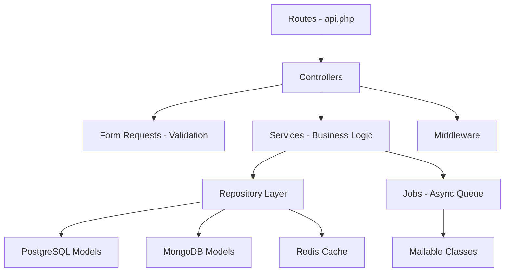
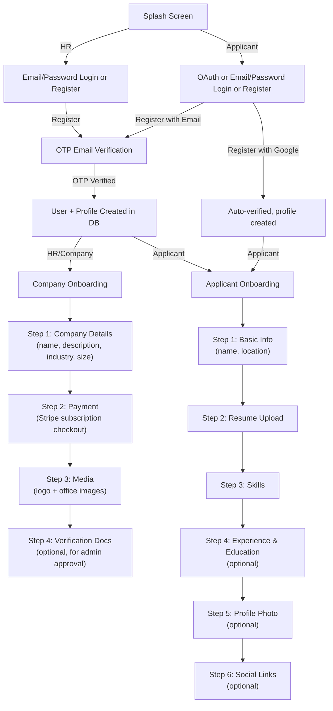

# JobSwipe Backend — Codebase Analysis

## Architecture Overview



| Layer | Tech | Purpose |
|---|---|---|
| **Auth** | Sanctum + OTP + Google OAuth | Token-based auth, OTP email verification |
| **RDBMS** | PostgreSQL | Users, profiles, subscriptions, jobs, applications |
| **Document Store** | MongoDB | Applicant/Company rich profile documents, swipe history |
| **Cache** | Redis | OTP codes, swipe dedup, daily counters, deck seen-set |
| **File Storage** | Cloudflare R2 (S3-compat) | Presigned upload for images & documents |
| **Payments** | Stripe (Checkout + Webhooks) | Company subscription billing |
| **Queues** | Laravel Horizon (Redis) | Emails, match notifications |

---

## ✅ Strengths

### 1. Solid Layered Architecture
The codebase follows a clean **Controller → Service → Repository** pattern. Business logic lives in Services, data access in Repositories, and HTTP concerns in Controllers. This makes the code testable and maintainable.

### 2. Polyglot Persistence Done Right
Smart use of **three data stores** for their respective strengths:
- **PostgreSQL**: Structured/relational data (users, subscriptions, job postings with FK constraints, CHECK constraints)
- **MongoDB**: Schema-flexible profile documents and swipe history (nested arrays of experience, education, skills)
- **Redis**: Ephemeral high-speed caching (OTPs, swipe dedup, daily counters)

### 3. Well-Designed Auth Flow
- OTP-based email verification with **hashed codes** (SHA-256), max 5 attempts, TTL via Redis
- Rate-limit protection against brute-force
- Google OAuth restricted to [applicant](file:///Users/apple/Desktop/DevWork/Project/JobSwipe/JobSwipe/backend/app/Models/PostgreSQL/User.php#61-65) role only — HR/company must use email+password
- Registration data stored in Redis until OTP is verified (no unverified users in the DB)

### 4. Robust Swipe Dedup Strategy
The [SwipeService](file:///Users/apple/Desktop/DevWork/Project/JobSwipe/JobSwipe/backend/app/Services/SwipeService.php#12-217) uses a **Redis-first, MongoDB-fallback** deduplication pattern with automatic Redis rehydration. This is a textbook approach for high-throughput dedup.

### 5. Smart Deck Relevance Scoring
[DeckService](file:///Users/apple/Desktop/DevWork/Project/JobSwipe/JobSwipe/backend/app/Services/DeckService.php#12-139) implements a weighted scoring algorithm: `skill_match(0.7) + recency(0.3) + location_bonus + remote_bonus`. This is a pragmatic approach for a swipe-based job app.

### 6. Clean Middleware
Role-based access via [CheckRole](file:///Users/apple/Desktop/DevWork/Project/JobSwipe/JobSwipe/backend/app/Http/Middleware/CheckRole.php#10-35) middleware and [CheckSwipeLimit](file:///Users/apple/Desktop/DevWork/Project/JobSwipe/JobSwipe/backend/app/Http/Middleware/CheckSwipeLimit.php#9-54) for rate-limiting swipes — applied surgically on specific route groups.

### 7. Well-Structured Onboarding System
Step-based onboarding with per-step validation, progress tracking, and profile completion percentage. Both applicant (6 steps) and company (4 steps) paths are clearly defined.

### 8. Good Security Practices
- Password hashing with configurable rounds
- URL validation against whitelisted R2 hosts for file uploads
- Anti-enumeration on [resendVerification](file:///Users/apple/Desktop/DevWork/Project/JobSwipe/JobSwipe/backend/app/Http/Controllers/Auth/AuthController.php#65-74) endpoint
- Stripe webhook signature verification setup
- `is_banned` check on login and OAuth

---

## ⚠️ Criticisms

### 1. Bug — Wrong Repository in [ensureApplicantDocument()](file:///Users/apple/Desktop/DevWork/Project/JobSwipe/JobSwipe/backend/app/Services/ProfileService.php#571-603)
In [ProfileService.php:577](file:///Users/apple/Desktop/DevWork/Project/JobSwipe/JobSwipe/backend/app/Services/ProfileService.php#L577):
```php
$profile = $this->companyDocs->update($profile, ['user_id' => $userId]);
```
This uses `companyDocs` to update an **applicant** document — should be `$this->applicantDocs->update(...)`.

### 2. `OTPService::sendOtp()` Signature Is Rigid
The [sendOtp](file:///Users/apple/Desktop/DevWork/Project/JobSwipe/JobSwipe/backend/app/Services/OTPService.php#15-24) method requires `$passwordHash` and `$role` — but it's also called from `AuthService::login()` (line 87) and [resendOtp()](file:///Users/apple/Desktop/DevWork/Project/JobSwipe/JobSwipe/backend/app/Services/AuthService.php#162-166) (line 164) where those params aren't available. The [resendOtp](file:///Users/apple/Desktop/DevWork/Project/JobSwipe/JobSwipe/backend/app/Services/AuthService.php#162-166) method just calls [sendOtp($email)](file:///Users/apple/Desktop/DevWork/Project/JobSwipe/JobSwipe/backend/app/Services/OTPService.php#15-24) with only 1 arg, which would fail since `$passwordHash` and `$role` are required params (no defaults).

### 3. [ProfileService](file:///Users/apple/Desktop/DevWork/Project/JobSwipe/JobSwipe/backend/app/Services/ProfileService.php#15-880) Is a 880-Line God Class
This single file handles: profile creation, retrieval, updates, onboarding logic, profile completion calculation, social link validation, and onboarding step orchestration. It should be decomposed into smaller focused services (e.g., `OnboardingService`, `ProfileCompletionService`).

### 4. Missing Interface/Contract Layer
Repositories are concrete classes registered as singletons — no interfaces. This makes it harder to swap implementations or mock in tests without Laravel's container.

### 5. `env()` Called at Runtime
In [SubscriptionService.php:36](file:///Users/apple/Desktop/DevWork/Project/JobSwipe/JobSwipe/backend/app/Services/SubscriptionService.php#L36):
```php
$priceId = (string) env('STRIPE_BASIC_PRICE_ID', '');
```
`env()` should never be called outside `config/` files. After `php artisan config:cache`, `env()` returns `null`. Use `config('services.stripe.basic_price_id')` instead.

### 6. No Admin/Moderator Endpoints
The users table supports `moderator` and `super_admin` roles, and there's a `company_verifications` table with `reviewed_by` referencing users — yet there are **zero admin endpoints** for reviewing/approving/rejecting company verifications.

### 7. [DeckService](file:///Users/apple/Desktop/DevWork/Project/JobSwipe/JobSwipe/backend/app/Services/DeckService.php#12-139) Loads ALL Jobs into Memory
```php
$jobs = JobPosting::active()->whereNotIn('id', $seenJobIds)->with(['skills', 'company'])->get();
```
The entire result set is loaded, scored in PHP, and then truncated to `$perPage`. This won't scale. Should use cursor-based pagination or push scoring to the database.

### 8. No Rate Limiting on API Routes
There's no throttle middleware applied to auth routes ([register](file:///Users/apple/Desktop/DevWork/Project/JobSwipe/JobSwipe/backend/app/Http/Controllers/Auth/AuthController.php#17-42), [login](file:///Users/apple/Desktop/DevWork/Project/JobSwipe/JobSwipe/backend/app/Http/Controllers/Auth/AuthController.php#75-89), `verify-email`). These are prime targets for brute-force and credential-stuffing.

### 9. Debug Route Exposed in Production
The `/debug/database` route (line 22 of [api.php](file:///Users/apple/Desktop/DevWork/Project/JobSwipe/JobSwipe/backend/routes/api.php)) dumps all table names, row counts, and Redis keys — a massive security risk if not gated by environment.

### 10. Mixed `onboarding_step` Type
`onboarding_step` stores either an [int](file:///Users/apple/Desktop/DevWork/Project/JobSwipe/JobSwipe/backend/app/Models/PostgreSQL/ApplicantProfile.php#36-40) (1-6) or the string `'completed'`. This type inconsistency can lead to subtle bugs (e.g., comparison with `===`). Better to use a separate `is_onboarding_complete` boolean.

### 11. No Cascade Delete for MongoDB
When a user is deleted in PostgreSQL (cascade deletes the profile), the corresponding MongoDB documents (applicant/company profile docs, swipe history) are **orphaned** — no cleanup mechanism exists.

### 12. Company Profile `user_id` Is Not Unique in Migration
The `company_profiles` migration creates a `UNIQUE INDEX` on `user_id` via raw SQL, but the column definition doesn't use `->unique()`. While functionally equivalent, this is inconsistent with the `applicant_profiles` migration which uses `$table->uuid('user_id')->unique()`.

---

## Task: Onboarding Fields Breakdown

### Applicant Onboarding (6 Steps)

| Step | Key | Required? | Fields to Fill |
|------|-----|-----------|----------------|
| **1** | `basic_info` | ✅ Yes | `first_name`, `last_name`, `location` (also accepts optional `bio`, `location_city`, `location_region`) |
| **2** | `resume_upload` | ✅ Yes | `resume_url` (upload resume via presigned URL flow first, then pass the URL) |
| **3** | `skills` | ✅ Yes | `skills[]` — array of skill objects, minimum 1 skill |
| **4** | `experience_education` | ❌ No | `work_experience[]` — array of `{company, position, start_date, end_date, is_current, description}` and `education[]` — array of `{institution, degree, field, graduation_year}` |
| **5** | `profile_photo` | ❌ No | `profile_photo_url` (upload photo via presigned URL, then pass URL) |
| **6** | `social_links` | ❌ No | `social_links` object containing optional `linkedin`, `github`, `portfolio` URLs (validated formats) |

### HR/Company Onboarding (4 Steps)

| Step | Key | Required? | Fields to Fill |
|------|-----|-----------|----------------|
| **1** | `company_details` | ✅ Yes | `company_name`, `description`, `industry`, `company_size` (also accepts optional `tagline`, `founded_year`, `website_url`, `address`, `social_links`) |
| **2** | `payment` | ✅ Yes | **No fields to submit** — this step verifies that the company has an **active Stripe subscription** (`subscription_status === 'active'`). They must complete the Stripe checkout flow first via `POST /v1/subscriptions/checkout`. |
| **3** | `media` | ✅ Yes | `logo_url` (required) + `office_images[]` (1–6 images required, array of URLs) |
| **4** | `verification_documents` | ❌ No | `verification_documents[]` — array of document URLs (for admin review). Submitting sets `verification_status` to `pending`. |

### How the Flow Maps to Your Expected Flow



> [!IMPORTANT]
> For **HR/Company**: Payment (Step 2) happens **during** onboarding, not after admin approval. The current flow is: fill company details → pay for subscription → upload media → optionally submit verification docs. Admin approval of verification docs is a **separate concern** and there are no admin endpoints built for it yet.

> [!NOTE]
> This is a deviation from your expected flow where "if their details gets approved by admin then they pay for verification". In the current codebase, **payment comes before verification document submission** (Step 2 before Step 4). The admin approval flow itself is not implemented — only the `company_verifications` database table and `verification_status` field exist.
