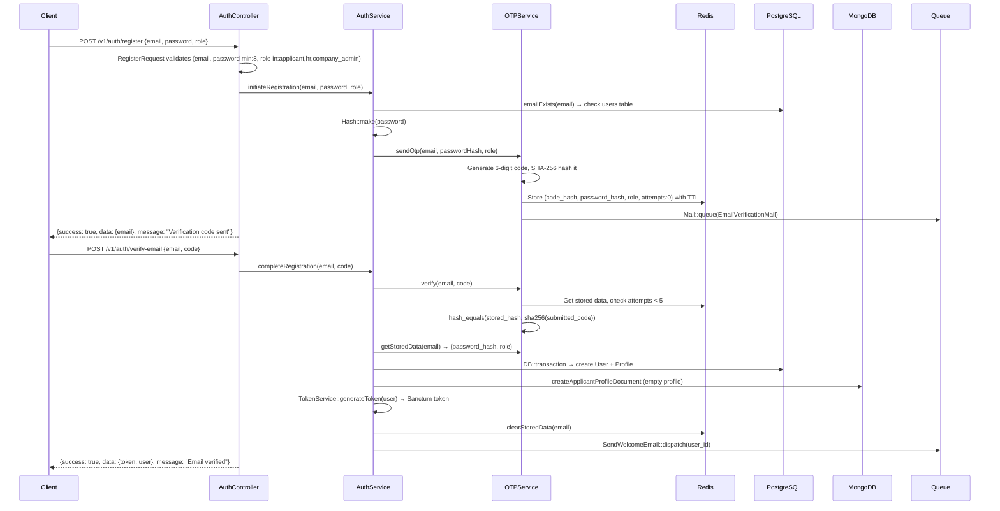

# JobSwipe Backend — Deep Code Analysis Report (2026-04-02)

> **Analyzer:** SWE Code Review  
> **Scope:** Full backend codebase at `/backend/app/`  
> **Compared Against:** `backend__analysis.md` (dated 2026-03-31)  
> **Note:** Debug endpoints are disregarded per instruction — they will be removed pre-production.

---

## Table of Contents

1. [What's New Since Last Analysis](#1-whats-new-since-last-analysis)
2. [Criticisms & Anti-Patterns](#2-criticisms--anti-patterns)
3. [Logic Bugs](#3-logic-bugs)
4. [Security Vulnerabilities](#4-security-vulnerabilities)
5. [E2E Flow Explanation](#5-e2e-flow-explanation)
6. [Edge Cases](#6-edge-cases)
7. [`backend__analysis.md` Cross-Reference](#7-backendanalysismd-cross-reference)

---

## 1. What's New Since Last Analysis

The following have been implemented since the 2026-03-31 audit:

### 1.1 ✅ Full IAP (In-App Purchase) System
A complete provider-agnostic IAP system has been implemented:
- **`IAPService`** (636 lines) — orchestrates purchase processing, webhook handling for Apple/Google, idempotency
- **`IAPController`** — thin controller with `purchase()`, `getSubscriptionStatus()`, `getPurchaseHistory()`, `cancelSubscription()`
- **`AppleReceiptValidator`** — production-first with 21007 sandbox fallback, timeout handling
- **`GoogleReceiptValidator`** — uses Google Play Developer API via service account, state validation
- **`ApplicantSubscriptionManager`** — full lifecycle: `activate()`, `renew()`, `expire()`, `cancel()`, `markPastDue()`, `refund()`
- **`SwipePackManager`** — purchase and refund handling with balance management
- **`PurchaseRequest`** — FormRequest validation for IAP input

### 1.2 ✅ Apple & Google Webhook Controllers
- **`AppleWebhookController`** — handles `DID_RENEW`, `DID_FAIL_TO_RENEW`, `EXPIRED`, `REFUND`
- **`GoogleWebhookController`** — handles Google Play notification types (2=renewed, 3=canceled, 13=expired, 12=revoked)
- Both use event deduplication via `WebhookEventRepository`
- Both return 200 on errors to prevent provider retries

### 1.3 ✅ IAP Database Infrastructure
Six new migrations added:
- `iap_transactions` — transaction deduplication
- `iap_receipts` — receipt audit trail
- `iap_idempotency_keys` — purchase idempotency
- `iap_webhook_events` — webhook deduplication
- `add_refunded_status_to_subscriptions` — supports refund state
- `add_currency_to_swipe_packs_table` — currency support for packs

### 1.4 ✅ New PostgreSQL Repositories
- `IAPIdempotencyRepository` — reserve/persist/release pattern for purchase idempotency
- `IAPReceiptRepository` — receipt storage for audit
- `IAPTransactionRepository` — transaction dedup checks
- `SwipePackRepository` — swipe pack CRUD
- `WebhookEventRepository` — webhook event dedup
- `SubscriptionRepository` — full subscription queries (findActiveForUser, findByProviderSubId, findByTransactionId, getAllForUser)

### 1.5 ✅ New PostgreSQL Models
- `IAPIdempotencyKey`, `IAPReceipt`, `IAPTransaction`, `WebhookEvent`, `SwipePack`

### 1.6 ✅ Applicant Subscription Routes
Three new endpoints under `applicant/`:
```
GET  /api/v1/applicant/subscription/status
GET  /api/v1/applicant/purchases
POST /api/v1/applicant/subscription/cancel
```

### 1.7 ✅ Scheduled Job for Subscription Expiry
- `ExpireApplicantSubscriptionsJob` — runs hourly, expires active subscriptions past `current_period_end`, handles `past_due` grace period (configurable, default 7 days)

### 1.8 ✅ Global Exception Handler
`bootstrap/app.php` now has a structured `withExceptions()` configuration:
- `ValidationException` → `{success: false, code: VALIDATION_ERROR, errors: {...}}` (400)
- `NotFoundHttpException` → `{success: false, code: NOT_FOUND}` (404)
- `ApiErrorException` (Stripe) → `{success: false, code: STRIPE_API_ERROR}` (500)
- `shouldRenderJsonWhen` → returns JSON for all `api/*` routes

### 1.9 ✅ `IAPException` with `render()` method
Self-rendering exception with `{success, message, code}` envelope — consistent with `SubscriptionException`.

### 1.10 ✅ OAuthController Now Uses Base Helpers
`OAuthController` now uses `$this->success()` and `$this->error()` via the `ApiResponse` trait — the previous analysis flagged this as inconsistent.

### 1.11 ✅ OTP Verification Uses Strict Comparison
`OTPService::verify()` now uses `=== null` (strict comparison) instead of `== null`. The loose comparison issue from the previous analysis has been fixed.

### 1.12 ✅ Duplicate PointService Singleton Removed
`AppServiceProvider` no longer has a duplicate `PointService::class` registration. Line 88/90 now only has one registration at line 88.

### 1.13 ✅ `SwipeCacheRepository` Uses Config Timezone
The `counterKey()` method now uses `config('app.timezone')` instead of the hardcoded `'Asia/Manila'`. Note: `incrementCounter()` still hardcodes `'Asia/Manila'` for the TTL calculation — see [Logic Bug 3.5](#35--swipecacherepository-timezone-inconsistency).

### 1.14 ✅ `UserDataCleanupService` 
New service that handles cascading cleanup when a user is deleted:
- Removes MongoDB documents (applicant profile, company profile, swipe history)
- Clears Redis cache keys (deck seen, counters, HR seen, points)
- Uses `SCAN` instead of `KEYS` for pattern deletion — production-safe

### 1.15 ✅ `applicant_seen_jobs` PostgreSQL Table
New migration and anti-join pattern for deck queries. Eliminates the `WHERE id NOT IN (...)` performance problem by using `WHERE NOT EXISTS (subquery)` instead.

---

## 2. Criticisms & Anti-Patterns

### 2.1 🔴 `ProfileService` Constructor Still Bypasses DI

```php
public function __construct(
    ...
    ?ProfileCompletionService $completion = null,
    ?ProfileOnboardingService $onboarding = null,
    ?ProfileSocialLinksValidator $socialLinksValidator = null,
) {
    $this->completion = $completion ?? new ProfileCompletionService;
    $this->socialLinksValidator = $socialLinksValidator ?? new ProfileSocialLinksValidator;
    $this->onboarding = $onboarding ?? new ProfileOnboardingService(...);
}
```

**Still unfixed from previous analysis.** The `?? new X()` fallback creates instances outside the IoC container. All three services (`ProfileCompletionService`, `ProfileOnboardingService`, `ProfileSocialLinksValidator`) are registered as singletons in `AppServiceProvider`, but the nullable+fallback pattern means:
- In tests, you can't override them without explicitly passing them
- The manually-constructed `ProfileOnboardingService` receives raw repository instances, not the container-resolved singletons
- Memory waste: up to 3 extra instances created unnecessarily

**Fix:** Remove the nullable parameters. Rely on the container.

### 2.2 🔴 `PasswordResetService` Still Uses `app()` Locator

In `AuthService`:
```php
app(PasswordResetService::class)->sendResetCode($email);  // line 107
$passwordResetService = app(PasswordResetService::class);  // line 120
```

**Still unfixed from previous analysis.** Should be injected via constructor. `PasswordResetService` *is* registered in the container (auto-resolved), but it's a hidden dependency not visible in the constructor.

### 2.3 🟡 `GoogleReceiptValidator` Throws in Constructor

```php
public function __construct()
{
    ...
    if (empty($serviceAccountJson) || !file_exists($serviceAccountJson)) {
        throw new IAPException(...);
    }
}
```

This throws during **container resolution**, not during a request. If `GoogleReceiptValidator` is resolved as part of `IAPService`'s constructor chain, a missing config file will crash the **entire application** at boot time for every request, not just IAP requests. This should be a **lazy validation** (check in `verify()`) or the binding should be conditional.

### 2.4 🟡 `IAPController` Redundant Role Checks

The controller methods `getSubscriptionStatus()`, `getPurchaseHistory()`, and `cancelSubscription()` manually check `$request->user()->role !== 'applicant'` — but these routes already have `middleware('role:applicant')` applied in `api.php`. The in-controller check is dead code that adds noise.

### 2.5 🟡 `SwipeService` Still Queries Model Directly

```php
$applicant = ApplicantProfile::where('user_id', $userId)->firstOrFail();
```

**Still unfixed from previous analysis.** This appears in both `applicantSwipeRight()` and `applicantSwipeLeft()`. The service should use `$this->applicantProfiles->findByUserId()` via injected repository, but `ApplicantProfileRepository` is not injected into `SwipeService`.

### 2.6 🟡 Subscription Model Missing `boot()` UUID Generation

The `Subscription` model has `$incrementing = false` and `$keyType = 'string'`, but doesn't have a `boot()` method to auto-generate UUIDs. Compare with `User` which has:
```php
static::creating(function ($model) {
    if (empty($model->id)) {
        $model->id = (string) Str::uuid();
    }
});
```

If `Subscription::create()` is called without an explicit `id`, the record will be inserted with a `null` primary key, causing a database error. The same issue likely applies to `ApplicantProfile`, `CompanyProfile`, `Application`, and other models with `$incrementing = false`.

### 2.7 🟡 Inconsistent Error Response Patterns in Webhook Controllers

Both `AppleWebhookController` and `GoogleWebhookController` return raw `response()->json()` instead of using `$this->success()` / `$this->error()`:
```php
return response()->json(['status' => 'success'], 200);
return response()->json(['status' => 'error', 'message' => $e->getMessage()], 200);
```

This breaks the `{success, message, code}` envelope. While webhook responses don't need to follow the public API envelope, it's inconsistent. More concerning: error responses **leak exception messages** to the webhook caller (Apple/Google), which could expose internal details.

### 2.8 🟡 `SubscriptionRepository::findByTransactionId()` Has Weak Linkage

```php
public function findByTransactionId(string $transactionId): ?Subscription
{
    $transaction = IAPTransaction::where('transaction_id', $transactionId)->first();
    if (!$transaction) return null;
    return Subscription::where('user_id', $transaction->user_id)
        ->where('subscriber_type', 'applicant')
        ->orderBy('created_at', 'desc')
        ->first();
}
```

This finds the *most recent* subscription for the user, not the subscription linked to the specific transaction. If a user has multiple subscriptions (e.g., subscribed, expired, re-subscribed), refunding an old transaction would affect the current subscription.

### 2.9 ⚠️ No `PasswordResetService` Singleton Registration

`PasswordResetService` is used via `app()` locator but never registered as a singleton in `AppServiceProvider`. Laravel auto-resolves it, but each `app()` call creates a new instance — inconsistent with the singleton pattern used for everything else.

---

## 3. Logic Bugs

### 3.1 🔴 `GoogleReceiptValidator::verify()` Returns Wrong Key Name

The method returns:
```php
return [
    'order_id' => $purchase->getOrderId(),       // ← "order_id"
    'product_id' => $productId,
    'purchase_time' => (int) ($purchase->...),    // ← "purchase_time"
];
```

But `IAPService::processPurchase()` expects:
```php
$transactionId = $verificationResult['transaction_id'];     // ← expects "transaction_id"
$purchaseDate = Carbon::createFromTimestamp($verificationResult['purchase_date']); // ← expects "purchase_date"
```

**Any Google Play purchase will throw `Undefined array key 'transaction_id'`** because the validator returns `order_id` instead of `transaction_id`, and `purchase_time` instead of `purchase_date`. Apple's validator correctly returns `transaction_id` and `purchase_date`.

### 3.2 🔴 `ExpireApplicantSubscriptionsJob` References Wrong Field

```php
Log::info('...', [
    'user_id' => $subscription->subscriber_id,  // ← WRONG
]);
```

The `Subscription` model has `user_id`, not `subscriber_id`. This will log `null` for every expiration. Not a runtime crash (it's just logging), but indicates the job wasn't tested against real data.

### 3.3 🟡 `SwipeService::applicantSwipeRight()` Double Swipe-Limit Check

The method checks `hasSwipesRemaining()` at line 27, but the route already has `swipe.limit` middleware via `CheckSwipeLimit`. Both checks hit the database. The service-level check uses `ApplicantProfile::where(...)->firstOrFail()` while the middleware uses `$user->applicantProfile` (eager-loaded relationship). If the profile is modified between the two checks (e.g., by a concurrent swipe), the results could diverge — a **TOCTOU race condition**.

### 3.4 🟡 `hrSwipeRight()` Wraps MongoDB + PostgreSQL in Single `DB::transaction()`

```php
DB::transaction(function () use (...) {
    $this->swipeHistory->recordSwipe([...]);    // MongoDB write
    $this->applications->markInvited(...);       // PostgreSQL write
});
```

`DB::transaction()` only covers PostgreSQL. The MongoDB write inside is **not transactional**. If `markInvited()` fails, the PostgreSQL transaction rolls back, but the MongoDB swipe record persists — creating a phantom swipe. The applicant-side code handles this correctly with a manual MongoDB rollback, but the HR side does not.

### 3.5 🟡 `SwipeCacheRepository` Timezone Inconsistency

`counterKey()` uses `config('app.timezone')` (fixed from previous analysis), but `incrementCounter()` and `refreshCounter()` still hardcode `'Asia/Manila'`:
```php
$secondsUntilMidnight = Carbon::now('Asia/Manila')->secondsUntilEndOfDay();
```

If `app.timezone` is changed from `Asia/Manila`, the counter key date and the TTL midnight calculation will be in different timezones, causing counters to expire at the wrong time.

### 3.6 🟡 `Subscription` Model Missing UUID `boot()`

As noted in [2.6](#26--subscription-model-missing-boot-uuid-generation), `Subscription` has `$incrementing = false` but no UUID generation. Looking at the migration `create_subscriptions_table.php`, if the primary key uses `$table->uuid('id')->primary()`, then `Subscription::create()` without an `id` will fail with a `NOT NULL constraint violation`.

### 3.7 ⚠️ `DeckService::getJobDeck()` Relevance Sorting Breaks Cursor Pagination

The deck fetches a candidate pool sorted by `published_at DESC`, applies relevance scoring, then re-sorts by `relevance_score DESC`:
```php
$sortedJobs = $scoredJobs->sortByDesc('relevance_score')->take($perPage)->values();
```

But the cursor for the *next page* is built from the chronologically-last job in the candidate pool, not the last job in the relevance-sorted result. This means:
- Page 1 fetches jobs 1-100 by recency, scores them, shows top 20 by relevance
- Page 2 fetches jobs 101-200 by recency
- A highly-relevant job at position 85 (by recency) gets shown on page 1, but a slightly less relevant job at position 25 might get skipped entirely

The relevance sort and cursor-based pagination are fundamentally incompatible in this design.

---

## 4. Security Vulnerabilities

### 4.1 🔴 Apple/Google Webhook Endpoints Have No Signature Verification

```php
// AppleWebhookController
public function handleNotification(Request $request): JsonResponse
{
    $notification = $request->all();  // ← No signature check
    $this->iapService->processAppleWebhook($notification);
    ...
}
```

The Stripe webhook correctly verifies the `Stripe-Signature` header using `Webhook::constructEvent()`. However:
- **Apple webhook** has no JWS (JSON Web Signature) verification of the notification payload
- **Google webhook** has no verification of the Pub/Sub message signature or Bearer token

Anyone can POST to these endpoints and fake subscription renewals, expirations, or refunds. An attacker could:
- Grant themselves a pro subscription by sending a fake `DID_RENEW` notification
- Revoke another user's subscription by faking an `EXPIRED` event

### 4.2 🟡 Webhook Error Responses Leak Stack Traces

```php
return response()->json([
    'status' => 'error',
    'message' => $e->getMessage(),  // ← Internal details sent to Apple/Google
], 200);
```

While Apple/Google won't exploit this, any interceptor on the network path could capture internal error messages.

### 4.3 🟡 No Rate Limiting on Webhook Endpoints

The webhook routes are inside the `throttle:api-tiered` group, which limits to 20 req/min for unauthenticated requests. This is too aggressive for legitimate webhooks (a burst of subscription events could be throttled) and doesn't specifically target abuse patterns.

### 4.4 ⚠️ `AppleReceiptValidator` Shared Secret in Config

The Apple shared secret is stored in config and sent with every verification request. If the config leaks (via debug routes, error pages, etc.), anyone can verify receipts. This is by design (Apple requires it), but the config key should be in `.env` only, never in version-controlled config files.

---

## 5. E2E Flow Explanation

### 5.1 Registration Flow (Applicant)



**Key Design Decisions:**
- User record is **not created until OTP is verified** — prevents unverified accounts in DB
- Password is hashed **before** Redis storage, never stored in plaintext even in cache
- OTP code itself is SHA-256 hashed in Redis — even Redis access doesn't reveal the code
- Maximum 5 OTP attempts before lockout (requires resend)

### 5.2 Login Flow

```
Client → POST /v1/auth/login {email, password}
  → AuthController → LoginRequest validates
  → AuthService.login()
    → UserRepository.findByEmail() → null? → "invalid_credentials"
    → Hash::check(password, user.password_hash) → false? → "invalid_credentials"
    → user.is_banned? → "banned"
    → user.hasVerifiedEmail()? → false? → resend OTP → "unverified"
    → TokenService.generateToken(user) → Sanctum token
  → Response: {token, user}
```

**Edge case handled:** If the user exists but hasn't verified email, the system automatically resends the OTP and returns `unverified` status so the client can redirect to the verification screen.

### 5.3 Google OAuth Flow (Applicant Only)

```
Client → GET /v1/auth/google/redirect → returns {redirect_url}
Client opens redirect_url in browser → Google consent → callback

Google → GET /v1/auth/google/callback
  → OAuthController → Socialite::stateless()->user()
  → AuthService.handleGoogleCallback()
    → Case 1: User found by google_id → log them in
    → Case 2: User found by email (not by google_id) → link Google account
    → Case 3: No user found → create new user (role: applicant, random password)
    → All cases: check is_banned, generate token
  → Response: {token, user, is_new_user}
```

**Restriction:** Google OAuth is only allowed for `applicant` role. HR/company users must use email+password.

### 5.4 Applicant Swipe Flow

```
Client → GET /v1/applicant/swipe/deck?per_page=20&cursor=xxx
  → Middleware: auth:sanctum → verified → role:applicant
  → SwipeController → DeckService.getJobDeck()
    → ensureSeenJobsSynced() → one-time MongoDB→PG sync of seen jobs
    → Query active jobs WHERE NOT EXISTS in applicant_seen_jobs
    → Score by skill match (70%) + recency (30%) + location + remote bonus
    → Return top N by relevance + cursor for next page

Client → POST /v1/applicant/swipe/right/{jobId}
  → Middleware: auth:sanctum → verified → role:applicant → swipe.limit
  → SwipeController → SwipeService.applicantSwipeRight()
    → hasSwipesRemaining() → daily_swipes_used < daily_swipe_limit || extra_swipe_balance > 0
    → hasAlreadySwiped() → Redis SISMEMBER → miss? → MongoDB fallback
    → MongoDB: recordSwipe({direction: right, target: job_posting})
    → PostgreSQL: DB::transaction → create Application + increment daily_swipes_used
    → On PG failure: delete MongoDB swipe record (compensating transaction)
    → Redis: markJobSeen + incrementCounter
  → Response: {status: "applied"}

Client → POST /v1/applicant/swipe/left/{jobId}
  → Same flow except no Application created, just swipe record + counter
  → Response: {status: "dismissed"}
```

### 5.5 HR Review Flow

```
Client → GET /v1/company/jobs/{jobId}/applicants
  → Middleware: auth:sanctum → verified → role:hr,company_admin
  → ApplicantReviewController → ApplicationRepository.getPrioritizedApplicants()
  → Returns list of applicants who swiped right on this job

Client → POST /v1/company/jobs/{jobId}/applicants/{applicantId}/right
  → SwipeService.hrSwipeRight()
    → hasHrAlreadySwiped() → Redis → MongoDB fallback
    → DB::transaction → MongoDB swipe + PG markInvited()
    → Redis: markApplicantSeenByHr
    → Queue: SendMatchNotification::dispatch → email + in-app notification
  → Response: {status: "invited"}  ← IT'S A MATCH
```

### 5.6 Company Subscription Flow (Stripe)

```
Client → POST /v1/subscriptions/checkout {success_url, cancel_url}
  → Middleware: auth:sanctum → verified → role:hr,company_admin
  → SubscriptionController → SubscriptionService.createCheckoutSession()
    → Idempotency check (fingerprint the request → check DB for cached session)
    → Create Stripe Checkout Session (mode: subscription)
    → Persist session_id + checkout_url in idempotency table
  → Response: {checkout_url, session_id, idempotency_key}

Client → Opens checkout_url → Stripe Checkout → (success/cancel redirect)

Stripe → POST /v1/webhooks/stripe
  → SubscriptionController.handleWebhook()
    → Verify Stripe-Signature header
    → SubscriptionService.handleSubscriptionUpdated(event)
      → Deduplicate: reserveWebhookEvent() → unique insert
      → checkout.session.completed → activateSubscription()
        → CompanyProfile.subscription_tier = basic, subscription_status = active
        → Create/update Subscription record
      → customer.subscription.updated → update status
      → customer.subscription.deleted → deactivate
```

### 5.7 Applicant IAP Flow (Apple/Google)

```
Client → POST /v1/iap/purchase {payment_provider, product_id, receipt_data}
  → Middleware: auth:sanctum → verified → role:applicant
  → IAPController → IAPService.processPurchase()
    → Idempotency: generate key → reserve in iap_idempotency_keys table
    → Validate product against config('iap.products') catalog
    → Verify receipt with Apple/Google backend:
      → Apple: POST to verifyReceipt endpoint with shared secret
      → Google: API call via service account + Android Publisher API
    → Transaction dedup: check iap_transactions table
    → Store receipt in iap_receipts for audit
    → Route by product type:
      → subscription: ApplicantSubscriptionManager.activate()
        → Creates Subscription record + updates ApplicantProfile tier/limits
      → swipe_pack: SwipePackManager.purchase()
        → Creates SwipePack record + increments extra_swipe_balance
    → Store transaction for dedup
    → Persist idempotency result (for replay)
  → Response: {success, type, subscription/swipe_pack details}

Apple/Google → POST /v1/webhooks/apple-iap or google-play
  → Webhook controllers → IAPService.processAppleWebhook / processGoogleWebhook
    → Deduplicate event → Route by notification type → Update subscription state
```

### 5.8 Profile & Onboarding Flow

```
Client → GET /v1/profile/onboarding/status
  → ProfileController → ProfileService → ProfileOnboardingService
  → Returns: {current_step, steps: [{step, title, completed, required_fields}], is_complete}

Client → POST /v1/profile/onboarding/complete-step {step, data}
  → Validates step data → Updates MongoDB profile document → Advances step

Client → PATCH /v1/profile/applicant/basic-info {first_name, last_name, bio, ...}
  → ProfileService.updateApplicantBasicInfo() → allowlisted fields → MongoDB update
  → Recalculates profile completion percentage
  → Awards points for first-time completions (bio_added, skills_added, etc.)
```

### 5.9 Daily Lifecycle (Scheduled Jobs)

```
Every 30 minutes: ExpireJobPostingsJob
  → Find active jobs past expires_at → set status = expired

Daily at midnight PHT: ResetDailySwipesJob
  → Reset daily_swipes_used = 0 for all applicants

Every hour: ExpireApplicantSubscriptionsJob
  → Expire active subscriptions where current_period_end < now()
  → Expire past_due subscriptions older than 7-day grace period
  → Downgrades applicant profile: subscription_status → inactive, daily_swipe_limit → free tier
```

---

## 6. Edge Cases

### 6.1 Race Conditions

| Scenario | Risk | Severity |
|---|---|---|
| Two concurrent swipe-right requests for same job | Double Application created. Redis `SISMEMBER` returns false for both before either writes. | 🔴 HIGH |
| Two concurrent HR swipes on same applicant | Double invitation sent, Mongo records duplication | 🟡 MEDIUM |
| User deletes account while IAP webhook arrives | `ApplicantSubscriptionManager.expire()` calls `findByUserId()` → returns null → silently exits. No cleanup of Subscription record. | 🟡 MEDIUM |
| Two concurrent `completeRegistration()` with same OTP | `DB::transaction` in `completeRegistration` doesn't lock on email — could create duplicate users. However, if Users table has unique constraint on email, second will fail with QueryException. | 🟡 MEDIUM |
| Stripe webhook arrives before checkout redirect completes | `handleSubscriptionUpdated` → `activateSubscription` runs → subscription created. Then user hits success_url and frontend fetches status → works correctly. No issue. | ✅ Safe |

### 6.2 Data Integrity Edge Cases

| Scenario | Impact |
|---|---|
| Applicant swipes right, MongoDB write succeeds, PG transaction fails, MongoDB rollback also fails | Orphaned swipe record in MongoDB. Job appears "seen" in Redis but no Application exists in PG. |
| `extra_swipe_balance` goes negative via concurrent swipe requests | `consumeApplicantSwipe()` uses `$applicant->decrement('extra_swipe_balance')` which is atomic, but `hasSwipesRemaining()` check that precedes it is not locked — TOCTOU gap allows going to -1. |
| Refund of swipe pack after user already used the swipes | `SwipePackManager::refund()` sets balance to `max(0, balance - quantity)` — gracefully handles this. ✅ |
| Apple/Google send the same webhook event twice | `webhookEvents->reserve()` uses unique insert — second attempt fails, returns false, silently ignores. ✅ |

### 6.3 Input & Boundary Edge Cases

| Scenario | Current Behavior | Should Be |
|---|---|---|
| `per_page=0` on deck endpoint | Clamped to `max(1, min(0, 50))` = 1 | ✅ Handled |
| Invalid base64 cursor string | `decodeCursor()` returns null, starts from beginning | ✅ Handled |
| OTP with leading zeros (e.g., "000123") | `str_pad` generates correct 6-char codes, `hash_equals` compares hashes — works | ✅ Handled |
| Very long email addresses (> 255 chars) | `RegisterRequest` should validate `max:255` — needs verification | ⚠️ Check |
| `receipt_data` is a massive array (DoS payload) | `PurchaseRequest` validates `required|array` but no size limit | 🟡 Missing |
| Swipe on non-existent jobId | `applicantSwipeRight` hits `ApplicationRepository.create()` which has a FK to `job_postings` → DB error → uncaught. Should validate job exists first. | 🟡 Missing |
| Swipe on expired/closed job | Job won't appear in deck (query filters `active()`) but a direct POST to `/swipe/right/{jobId}` would succeed — no server-side check that job is active. | 🟡 Missing |
| HR swipe on applicant who didn't apply to their job | No validation that an Application exists for this applicant+job combination. | 🟡 Missing |
| `work_experience` or `education` with negative index | `array_key_exists(-1, $items)` returns false → throws `InvalidArgumentException`. ✅ Handled. |
| Upload URL for file type not in allowed list | `FileUploadService` should validate file types — needs verification | ⚠️ Check |

### 6.4 Subscription Lifecycle Edge Cases

| Scenario | Behavior |
|---|---|
| Company subscribes via Stripe, then tries IAP | IAP route has `role:applicant` middleware — blocked. ✅ |
| Applicant has active Apple sub, buys Google sub | `ApplicantSubscriptionManager.activate()` checks for existing active sub → throws `SUBSCRIPTION_ALREADY_ACTIVE`. ✅ |
| Applicant sub expires, HR sub webhook arrives for same user_id | `SubscriptionRepository.findActiveForUser()` filters `subscriber_type = 'applicant'` — won't match HR sub. But company subs go through `SubscriptionService`, not `IAPService`. Different code paths, correct isolation. ✅ |
| Stripe webhook for `customer.subscription.deleted` arrives, but user already cancelled via API | `deactivateSubscription()` sets status to `cancelled`. Webhook also sets to `cancelled`. Idempotent. ✅ |

---

## 7. `backend__analysis.md` Cross-Reference

Below is a checklist of every recommendation from the original analysis, with implementation status:

### P0 — Do Immediately

| # | Recommendation | Status | Evidence |
|---|---|---|---|
| 1 | Remove or gate debug routes | ⏳ Deferred | Debug routes still exist in `api.php` — will be removed pre-production per user instruction. |
| 2 | Add global exception handler | ✅ **DONE** | `bootstrap/app.php` has `withExceptions()` with `ValidationException`, `NotFoundHttpException`, and `ApiErrorException` renderers. |
| 3 | Fix `extra_swipe_balance` field reference in `CheckSwipeLimit` | ✅ **DONE** | `CheckSwipeLimit` now calls `$applicant->hasSwipesRemaining()` which uses `extra_swipe_balance` (matching the model's `$fillable`). |
| 4 | Remove duplicate `PointService` singleton | ✅ **DONE** | `AppServiceProvider` line 88 has single registration. |

### P1 — Do This Sprint

| # | Recommendation | Status | Evidence |
|---|---|---|---|
| 5 | Write feature tests | ❌ Not done | `tests/Feature/` still empty |
| 6 | Create model factories and seeders | ❌ Not done | `database/seeders/` empty |
| 7 | Inject `PasswordResetService` via constructor | ❌ Not done | Still uses `app()` locator in `AuthService` |
| 8 | Make `OAuthController` use `$this->success()/$error()` | ✅ **DONE** | `OAuthController` now extends `Controller` with `ApiResponse` trait |
| 9 | Fix loose `==` to `===` in `OTPService::verify()` | ✅ **DONE** | `OTPService::verify()` uses `$stored === null` |
| 10 | Replace `'Asia/Manila'` hardcode in `SwipeCacheRepository` | ⚠️ Partial | `counterKey()` fixed; `incrementCounter()` and `refreshCounter()` still hardcode `'Asia/Manila'` |

### P2 — Do Next Sprint

| # | Recommendation | Status | Evidence |
|---|---|---|---|
| 11 | Implement Admin Panel APIs | ❌ Not done | No admin controllers/routes/services |
| 12 | Implement Company Reviews CRUD | ❌ Not done | Model exists, no controller/routes |
| 13 | Implement Applicant Applications list | ❌ Not done | No `ApplicationController` |
| 14 | Add repository interfaces (Contracts/) | ❌ Not done | No interfaces exist |
| 15 | Add PHPStan | ❌ Not done | Not in dependencies |
| 16 | Add Sentry | ❌ Not done | Not in dependencies |
| 17 | Update documentation to match namespaces | ❌ Not done | Docs still diverge |
| 18 | Set up GitHub Actions CI/CD | ❌ Not done | No workflow files |

### Documentation Gap Updates

| Feature | Previous Status | Current Status | Change |
|---|---|---|---|
| **Subscriptions: Apple IAP** | ❌ Not implemented | ✅ **Implemented** | Full receipt validation + webhook handling |
| **Subscriptions: Google Play Billing** | ❌ Not implemented | ✅ **Implemented** | Full receipt validation + webhook handling |
| **Subscriptions: Applicant subscriptions** | ❌ Not implemented | ✅ **Implemented** | Full lifecycle via `ApplicantSubscriptionManager` |
| **Swipe Packs (extra swipes purchase)** | ❌ Not implemented | ✅ **Implemented** | `SwipePackManager` + `IAPService` integration |
| **Global Exception Handler** | ❌ Not implemented | ✅ **Implemented** | Three renderers in `bootstrap/app.php` |
| **OAuthController response format** | ⚠️ Inconsistent | ✅ **Fixed** | Uses `ApiResponse` trait |
| **OTP loose comparison** | ⚠️ Bug | ✅ **Fixed** | Uses strict `===` |


---

*End of Analysis Report — 2026-04-02*
