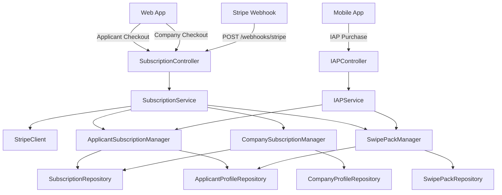

# Stripe Applicant Payments Implementation Plan

**Document Version:** 1.0  
**Date:** April 2, 2026  
**Status:** Planning Phase

> **Staleness note:** This is a historical v1 draft. Several assumptions here were superseded by later backend changes and by the v2 plan in this folder. Treat this file as archived guidance, not current implementation truth.

## Executive Summary

Currently, Stripe integration only handles company subscriptions for HR/company_admin users on the web platform. This creates a gap: web-based applicants have no way to purchase Pro subscriptions or swipe packs. Meanwhile, mobile applicants use Apple/Google IAP.

This implementation plan extends Stripe to support applicant payments on the web platform, creating a unified payment architecture where:
- **Web users (applicants + companies)** → Stripe
- **Mobile users (applicants + companies)** → Apple/Google IAP

## Current State Analysis

> **Note:** The matrix below reflects the assumptions that were true when this draft was written. Some of the "missing" items may now exist in the live codebase, so re-verify before using this as a task list.

### Existing Stripe Implementation

**What Works:**
- Company subscription checkout via Stripe
- Webhook handling for subscription lifecycle
- Idempotent checkout session creation
- Subscription status retrieval

**What's Missing:**
- Applicant subscription checkout
- Swipe pack one-time purchases
- Applicant-specific product catalog
- Applicant subscription management

### Current Payment Matrix

| User Type | Web Platform | Mobile Platform |
|-----------|--------------|-----------------|
| Applicant | ❌ No payment method | ✅ Apple/Google IAP |
| Company/HR | ✅ Stripe | ❌ No payment method |

### Target Payment Matrix

| User Type | Web Platform | Mobile Platform |
|-----------|--------------|-----------------|
| Applicant | ✅ Stripe (NEW) | ✅ Apple/Google IAP |
| Company/HR | ✅ Stripe | ✅ Apple/Google IAP (FUTURE) |


## Architecture Design

### Unified Payment Strategy

The system should support **three payment providers** with **two subscriber types**:

```
Payment Provider    Subscriber Type    Products
──────────────────────────────────────────────────────────────
Stripe (Web)     → Applicant       → Pro Sub + Swipe Packs
Stripe (Web)     → Company         → Company Sub (existing)
Apple IAP        → Applicant       → Pro Sub + Swipe Packs
Google Play      → Applicant       → Pro Sub + Swipe Packs
Apple IAP        → Company         → Company Sub (future)
Google Play      → Company         → Company Sub (future)
```

### Component Diagram



### Key Design Decisions

1. **Reuse Existing Infrastructure**: Extend `SubscriptionService` and `SubscriptionController` rather than creating separate applicant-specific classes

2. **Shared Subscription Manager**: Use the same `ApplicantSubscriptionManager` for both Stripe and IAP purchases (already exists for IAP)

3. **Product Catalog**: Extend Stripe product catalog to include applicant products

4. **Checkout Flow**: Create separate checkout methods for applicants vs companies, but use same underlying Stripe integration

5. **Webhook Handling**: Extend existing webhook handler to route applicant vs company events appropriately


---

## Implementation Plan

### Phase 1: Stripe Product Setup (Week 1)

#### Tasks

1. **Create Stripe Products** in Stripe Dashboard:
   ```
   Product: JobSwipe Pro (Applicant)
   - Price ID: price_applicant_pro_monthly
   - Amount: ₱199.00 PHP
   - Recurring: Monthly
   - Metadata: { "subscriber_type": "applicant", "tier": "pro" }
   
   Product: 5 Extra Swipes
   - Price ID: price_swipes_5
   - Amount: ₱49.00 PHP
   - One-time payment
   - Metadata: { "product_type": "swipe_pack", "quantity": "5" }
   
   Product: 10 Extra Swipes
   - Price ID: price_swipes_10
   - Amount: ₱89.00 PHP
   - One-time payment
   - Metadata: { "product_type": "swipe_pack", "quantity": "10" }
   
   Product: 15 Extra Swipes
   - Price ID: price_swipes_15
   - Amount: ₱119.00 PHP
   - One-time payment
   - Metadata: { "product_type": "swipe_pack", "quantity": "15" }
   ```

2. **Update Environment Variables**:
   ```env
   # Existing
   STRIPE_KEY=sk_...
   STRIPE_SECRET=sk_...
   STRIPE_WEBHOOK_SECRET=whsec_...
   
   # New - Applicant Products
   STRIPE_APPLICANT_PRO_MONTHLY_PRICE_ID=price_applicant_pro_monthly
   STRIPE_SWIPES_5_PRICE_ID=price_swipes_5
   STRIPE_SWIPES_10_PRICE_ID=price_swipes_10
   STRIPE_SWIPES_15_PRICE_ID=price_swipes_15
   ```

3. **Update Configuration** (`config/services.php`):
   ```php
   'stripe' => [
       'key' => env('STRIPE_KEY'),
       'secret' => env('STRIPE_SECRET'),
       'webhook_secret' => env('STRIPE_WEBHOOK_SECRET'),
       
       // Company products (existing)
       'company_subscription_price_id' => env('STRIPE_COMPANY_SUBSCRIPTION_PRICE_ID'),
       
       // Applicant products (new)
       'applicant_pro_monthly_price_id' => env('STRIPE_APPLICANT_PRO_MONTHLY_PRICE_ID'),
       'swipe_pack_prices' => [
           5 => env('STRIPE_SWIPES_5_PRICE_ID'),
           10 => env('STRIPE_SWIPES_10_PRICE_ID'),
           15 => env('STRIPE_SWIPES_15_PRICE_ID'),
       ],
   ],
   ```


---

### Phase 2: Backend Implementation (Weeks 2-3)

#### 2.1 Extend SubscriptionController

Add new endpoints for applicant checkout:

```php
// app/Http/Controllers/Subscription/SubscriptionController.php

/**
 * Create Stripe checkout session for applicant subscription
 * POST /api/v1/applicant/subscriptions/checkout
 * Middleware: auth:sanctum, role:applicant
 */
public function createApplicantCheckout(Request $request): JsonResponse
{
    $validated = $request->validate([
        'success_url' => ['required', 'url', 'max:2000'],
        'cancel_url' => ['required', 'url', 'max:2000'],
    ]);
    
    $idempotencyKey = trim((string) $request->header('Idempotency-Key', ''));
    
    $result = $this->subscriptions->createApplicantCheckoutSession(
        $request->user(),
        (string) $validated['success_url'],
        (string) $validated['cancel_url'],
        $idempotencyKey !== '' ? $idempotencyKey : null
    );
    
    return $this->success(data: $result, message: 'Checkout session created.');
}

/**
 * Create Stripe checkout session for swipe pack purchase
 * POST /api/v1/applicant/swipe-packs/checkout
 * Middleware: auth:sanctum, role:applicant
 */
public function createSwipePackCheckout(Request $request): JsonResponse
{
    $validated = $request->validate([
        'quantity' => ['required', 'in:5,10,15'],
        'success_url' => ['required', 'url', 'max:2000'],
        'cancel_url' => ['required', 'url', 'max:2000'],
    ]);
    
    $idempotencyKey = trim((string) $request->header('Idempotency-Key', ''));
    
    $result = $this->subscriptions->createSwipePackCheckoutSession(
        $request->user(),
        (int) $validated['quantity'],
        (string) $validated['success_url'],
        (string) $validated['cancel_url'],
        $idempotencyKey !== '' ? $idempotencyKey : null
    );
    
    return $this->success(data: $result, message: 'Checkout session created.');
}

/**
 * Get applicant subscription status (Stripe-based)
 * GET /api/v1/applicant/subscriptions/status
 * Middleware: auth:sanctum, role:applicant
 */
public function getApplicantSubscriptionStatus(Request $request): JsonResponse
{
    $status = $this->subscriptions->getApplicantSubscriptionStatus($request->user());
    return $this->success(data: $status);
}
```

#### 2.2 Extend SubscriptionService

Add methods for applicant checkout and swipe packs:

```php
// app/Services/SubscriptionService.php

/**
 * Create Stripe checkout session for applicant Pro subscription
 */
public function createApplicantCheckoutSession(
    User $user,
    string $successUrl,
    string $cancelUrl,
    ?string $idempotencyKey = null
): array {
    // Check if applicant already has active subscription
    $existingSub = $this->subscriptions->findActiveForUser($user->id, 'applicant');
    if ($existingSub) {
        throw new \Exception('Applicant already has an active subscription');
    }
    
    // Get price ID from config
    $priceId = config('services.stripe.applicant_pro_monthly_price_id');
    
    // Use existing idempotency pattern
    $idempotencyKey = $this->resolveCheckoutIdempotencyKey(
        $user->id,
        'applicant_subscription',
        $idempotencyKey
    );
    
    // Create Stripe checkout session
    $session = $this->stripeClient()->checkout->sessions->create([
        'customer_email' => $user->email,
        'mode' => 'subscription',
        'line_items' => [[
            'price' => $priceId,
            'quantity' => 1,
        ]],
        'success_url' => $successUrl,
        'cancel_url' => $cancelUrl,
        'metadata' => [
            'user_id' => $user->id,
            'subscriber_type' => 'applicant',
            'tier' => 'pro',
        ],
        'subscription_data' => [
            'metadata' => [
                'user_id' => $user->id,
                'subscriber_type' => 'applicant',
            ],
        ],
    ], [
        'idempotency_key' => $idempotencyKey,
    ]);
    
    return [
        'session_id' => $session->id,
        'checkout_url' => $session->url,
    ];
}

/**
 * Create Stripe checkout session for swipe pack purchase
 */
public function createSwipePackCheckoutSession(
    User $user,
    int $quantity,
    string $successUrl,
    string $cancelUrl,
    ?string $idempotencyKey = null
): array {
    // Get price ID from config
    $priceId = config("services.stripe.swipe_pack_prices.{$quantity}");
    
    if (!$priceId) {
        throw new \InvalidArgumentException("Invalid swipe pack quantity: {$quantity}");
    }
    
    // Use existing idempotency pattern
    $idempotencyKey = $this->resolveCheckoutIdempotencyKey(
        $user->id,
        "swipe_pack_{$quantity}",
        $idempotencyKey
    );
    
    // Create Stripe checkout session
    $session = $this->stripeClient()->checkout->sessions->create([
        'customer_email' => $user->email,
        'mode' => 'payment',  // One-time payment
        'line_items' => [[
            'price' => $priceId,
            'quantity' => 1,
        ]],
        'success_url' => $successUrl,
        'cancel_url' => $cancelUrl,
        'metadata' => [
            'user_id' => $user->id,
            'product_type' => 'swipe_pack',
            'swipe_quantity' => $quantity,
        ],
    ], [
        'idempotency_key' => $idempotencyKey,
    ]);
    
    return [
        'session_id' => $session->id,
        'checkout_url' => $session->url,
    ];
}

/**
 * Get applicant subscription status
 */
public function getApplicantSubscriptionStatus(User $user): array
{
    $subscription = $this->subscriptions->findActiveForUser($user->id, 'applicant');
    $applicantProfile = $this->applicantProfiles->findByUserId($user->id);
    
    return [
        'has_subscription' => $subscription !== null,
        'tier' => $applicantProfile->subscription_tier ?? 'free',
        'status' => $applicantProfile->subscription_status ?? 'inactive',
        'current_period_end' => $subscription?->current_period_end?->toIso8601String(),
        'daily_swipe_limit' => $applicantProfile->daily_swipe_limit ?? 20,
        'extra_swipe_balance' => $applicantProfile->extra_swipe_balance ?? 0,
        'payment_provider' => $subscription?->payment_provider,
    ];
}
```


#### 2.3 Extend Webhook Handler

Update the existing webhook handler to process applicant events:

```php
// app/Services/SubscriptionService.php

/**
 * Handle Stripe webhook events (existing method, extended)
 */
public function handleSubscriptionUpdated(array $event): void
{
    $eventType = $event['type'] ?? '';
    $eventData = $event['data']['object'] ?? [];
    
    // Extract metadata to determine subscriber type
    $metadata = $eventData['metadata'] ?? [];
    $subscriberType = $metadata['subscriber_type'] ?? 'company'; // default to company for backward compatibility
    
    match ($eventType) {
        'checkout.session.completed' => $this->handleCheckoutCompleted($eventData, $subscriberType),
        'customer.subscription.updated' => $this->handleSubscriptionUpdated($eventData, $subscriberType),
        'customer.subscription.deleted' => $this->handleSubscriptionDeleted($eventData, $subscriberType),
        'invoice.payment_succeeded' => $this->handlePaymentSucceeded($eventData, $subscriberType),
        'invoice.payment_failed' => $this->handlePaymentFailed($eventData, $subscriberType),
        'charge.refunded' => $this->handleRefund($eventData, $subscriberType),
        default => Log::info('Unhandled Stripe webhook event', ['type' => $eventType]),
    };
}

/**
 * Handle checkout.session.completed event
 */
private function handleCheckoutCompleted(array $session, string $subscriberType): void
{
    $userId = $session['metadata']['user_id'] ?? null;
    $productType = $session['metadata']['product_type'] ?? 'subscription';
    
    if (!$userId) {
        Log::warning('Checkout completed without user_id in metadata');
        return;
    }
    
    $user = $this->users->find($userId);
    if (!$user) {
        Log::warning('User not found for checkout', ['user_id' => $userId]);
        return;
    }
    
    if ($productType === 'swipe_pack') {
        $this->handleSwipePackPurchase($session, $user);
    } else {
        $this->handleSubscriptionActivation($session, $user, $subscriberType);
    }
}

/**
 * Handle swipe pack purchase from Stripe
 */
private function handleSwipePackPurchase(array $session, User $user): void
{
    $quantity = (int) ($session['metadata']['swipe_quantity'] ?? 0);
    $amountPaid = ($session['amount_total'] ?? 0) / 100; // Convert cents to PHP
    $paymentIntentId = $session['payment_intent'] ?? '';
    
    if ($quantity === 0) {
        Log::warning('Swipe pack purchase without quantity', ['session_id' => $session['id']]);
        return;
    }
    
    // Check for duplicate processing
    if ($this->swipePacks->findByProviderPaymentId($paymentIntentId)) {
        Log::info('Swipe pack already processed', ['payment_intent' => $paymentIntentId]);
        return;
    }
    
    DB::transaction(function () use ($user, $quantity, $amountPaid, $paymentIntentId) {
        // Get applicant profile
        $applicantProfile = $this->applicantProfiles->findByUserId($user->id);
        
        // Create swipe pack record
        $this->swipePacks->create([
            'applicant_id' => $applicantProfile->id,
            'quantity' => $quantity,
            'amount_paid' => $amountPaid,
            'currency' => 'PHP',
            'payment_provider' => 'stripe',
            'provider_payment_id' => $paymentIntentId,
            'purchased_at' => now(),
        ]);
        
        // Increment extra swipe balance
        $this->applicantProfiles->update($applicantProfile->id, [
            'extra_swipe_balance' => $applicantProfile->extra_swipe_balance + $quantity,
        ]);
        
        Log::info('Swipe pack purchased via Stripe', [
            'user_id' => $user->id,
            'quantity' => $quantity,
            'amount' => $amountPaid,
        ]);
    });
}

/**
 * Handle subscription activation from Stripe
 */
private function handleSubscriptionActivation(array $session, User $user, string $subscriberType): void
{
    $subscriptionId = $session['subscription'] ?? null;
    
    if (!$subscriptionId) {
        Log::warning('Checkout completed without subscription ID');
        return;
    }
    
    // Fetch full subscription details from Stripe
    $stripeSubscription = $this->stripeClient()->subscriptions->retrieve($subscriptionId);
    
    $tier = $session['metadata']['tier'] ?? 'basic';
    $status = $this->mapStripeStatus($stripeSubscription->status);
    
    DB::transaction(function () use ($user, $stripeSubscription, $tier, $status, $subscriberType) {
        // Create subscription record
        $subscription = $this->subscriptions->create([
            'user_id' => $user->id,
            'subscriber_type' => $subscriberType,
            'tier' => $tier,
            'status' => $status,
            'payment_provider' => 'stripe',
            'provider_subscription_id' => $stripeSubscription->id,
            'current_period_start' => Carbon::createFromTimestamp($stripeSubscription->current_period_start),
            'current_period_end' => Carbon::createFromTimestamp($stripeSubscription->current_period_end),
        ]);
        
        // Update profile based on subscriber type
        if ($subscriberType === 'applicant') {
            $applicantProfile = $this->applicantProfiles->findByUserId($user->id);
            $this->applicantProfiles->update($applicantProfile->id, [
                'subscription_tier' => $tier,
                'subscription_status' => $status,
                'daily_swipe_limit' => $tier === 'pro' ? 999 : 20,
            ]);
            
            Log::info('Applicant subscription activated via Stripe', [
                'user_id' => $user->id,
                'tier' => $tier,
                'subscription_id' => $subscription->id,
            ]);
        } else {
            // Existing company subscription logic
            $this->activateSubscription($user, $stripeSubscription->id, $stripeSubscription->status);
        }
    });
}

/**
 * Handle charge.refunded event
 */
private function handleRefund(array $charge, string $subscriberType): void
{
    $paymentIntentId = $charge['payment_intent'] ?? null;
    
    if (!$paymentIntentId) {
        return;
    }
    
    // Check if this was a swipe pack purchase
    $swipePack = $this->swipePacks->findByProviderPaymentId($paymentIntentId);
    
    if ($swipePack) {
        DB::transaction(function () use ($swipePack) {
            $applicantProfile = $this->applicantProfiles->find($swipePack->applicant_id);
            
            // Deduct refunded swipes from balance (don't go negative)
            $newBalance = max(0, $applicantProfile->extra_swipe_balance - $swipePack->quantity);
            
            $this->applicantProfiles->update($applicantProfile->id, [
                'extra_swipe_balance' => $newBalance,
            ]);
            
            Log::warning('Swipe pack refunded', [
                'swipe_pack_id' => $swipePack->id,
                'quantity' => $swipePack->quantity,
                'new_balance' => $newBalance,
            ]);
        });
    }
    
    // Handle subscription refunds (existing logic)
    // ...
}
```


#### 2.4 Add New Routes

Update `routes/api.php`:

```php
// Applicant Stripe payments (NEW)
Route::middleware('role:applicant')->prefix('applicant')->group(function () {
    // Subscription management
    Route::post('subscriptions/checkout', [SubscriptionController::class, 'createApplicantCheckout']);
    Route::get('subscriptions/status', [SubscriptionController::class, 'getApplicantSubscriptionStatus']);
    Route::post('subscriptions/cancel', [SubscriptionController::class, 'cancelApplicantSubscription']);
    
    // Swipe pack purchases
    Route::post('swipe-packs/checkout', [SubscriptionController::class, 'createSwipePackCheckout']);
    Route::get('swipe-packs/history', [SubscriptionController::class, 'getSwipePackHistory']);
    
    // IAP purchases (existing - for mobile)
    Route::post('iap/purchase', [IAPController::class, 'purchase']);
});
```

#### 2.5 Add SwipePack Repository Methods

```php
// app/Repositories/PostgreSQL/SwipePackRepository.php

/**
 * Find swipe pack by provider payment ID (for Stripe)
 */
public function findByProviderPaymentId(string $paymentId): ?SwipePack
{
    return SwipePack::where('provider_payment_id', $paymentId)->first();
}

/**
 * Get all swipe packs for applicant
 */
public function getAllForApplicant(string $applicantId): Collection
{
    return SwipePack::where('applicant_id', $applicantId)
        ->orderBy('purchased_at', 'desc')
        ->get();
}
```

#### 2.6 Add Controller Method for Swipe Pack History

```php
// app/Http/Controllers/Subscription/SubscriptionController.php

/**
 * Get swipe pack purchase history
 * GET /api/v1/applicant/swipe-packs/history
 */
public function getSwipePackHistory(Request $request): JsonResponse
{
    $user = $request->user();
    $applicantProfile = $this->applicantProfiles->findByUserId($user->id);
    
    $swipePacks = $this->swipePacks->getAllForApplicant($applicantProfile->id);
    
    $history = $swipePacks->map(fn($pack) => [
        'id' => $pack->id,
        'quantity' => $pack->quantity,
        'amount_paid' => $pack->amount_paid,
        'currency' => $pack->currency,
        'payment_provider' => $pack->payment_provider,
        'purchased_at' => $pack->purchased_at->toIso8601String(),
    ]);
    
    return $this->success(data: [
        'swipe_packs' => $history,
        'current_balance' => $applicantProfile->extra_swipe_balance,
    ]);
}

/**
 * Cancel applicant subscription (Stripe)
 * POST /api/v1/applicant/subscriptions/cancel
 */
public function cancelApplicantSubscription(Request $request): JsonResponse
{
    $user = $request->user();
    $subscription = $this->subscriptions->findActiveForUser($user->id, 'applicant');
    
    if (!$subscription) {
        return $this->error('NO_ACTIVE_SUBSCRIPTION', 'No active subscription found', 404);
    }
    
    if ($subscription->payment_provider !== 'stripe') {
        return $this->error(
            'WRONG_PAYMENT_PROVIDER',
            'This subscription was purchased through ' . $subscription->payment_provider . '. Please cancel through that platform.',
            400
        );
    }
    
    $this->subscriptions->deactivateSubscription($user);
    
    return $this->success(message: 'Subscription cancelled. Access will continue until the end of the current period.');
}
```


---

### Phase 3: Frontend Implementation (Week 4)

#### 3.1 Web App - Subscription Page

Create a subscription management page for applicants:

```typescript
// frontend/web/src/pages/applicant/subscription.tsx

import { useState, useEffect } from 'react';
import { useRouter } from 'next/router';
import { subscriptionApi } from '@/services/api/subscription';

export default function ApplicantSubscription() {
  const router = useRouter();
  const [status, setStatus] = useState(null);
  const [loading, setLoading] = useState(true);

  useEffect(() => {
    loadSubscriptionStatus();
  }, []);

  const loadSubscriptionStatus = async () => {
    try {
      const response = await subscriptionApi.getApplicantStatus();
      setStatus(response.data);
    } catch (error) {
      console.error('Failed to load subscription status', error);
    } finally {
      setLoading(false);
    }
  };

  const handleSubscribe = async () => {
    try {
      const response = await subscriptionApi.createApplicantCheckout({
        success_url: `${window.location.origin}/applicant/subscription?success=true`,
        cancel_url: `${window.location.origin}/applicant/subscription?cancelled=true`,
      });
      
      // Redirect to Stripe checkout
      window.location.href = response.data.checkout_url;
    } catch (error) {
      console.error('Failed to create checkout session', error);
    }
  };

  const handleCancel = async () => {
    if (!confirm('Are you sure you want to cancel your subscription?')) {
      return;
    }
    
    try {
      await subscriptionApi.cancelApplicantSubscription();
      await loadSubscriptionStatus();
      alert('Subscription cancelled. You will retain access until the end of your billing period.');
    } catch (error) {
      console.error('Failed to cancel subscription', error);
    }
  };

  if (loading) {
    return <div>Loading...</div>;
  }

  return (
    <div className="max-w-4xl mx-auto p-6">
      <h1 className="text-3xl font-bold mb-6">Subscription</h1>
      
      {status?.has_subscription ? (
        <div className="bg-white rounded-lg shadow p-6">
          <div className="flex justify-between items-start mb-4">
            <div>
              <h2 className="text-xl font-semibold">Pro Subscription</h2>
              <p className="text-gray-600">Status: {status.status}</p>
              <p className="text-gray-600">
                Renews: {new Date(status.current_period_end).toLocaleDateString()}
              </p>
            </div>
            <span className="px-3 py-1 bg-green-100 text-green-800 rounded-full text-sm">
              Active
            </span>
          </div>
          
          <div className="border-t pt-4 mt-4">
            <h3 className="font-semibold mb-2">Benefits:</h3>
            <ul className="list-disc list-inside space-y-1 text-gray-700">
              <li>Unlimited daily swipes ({status.daily_swipe_limit} per day)</li>
              <li>Priority in job matches</li>
              <li>Advanced profile features</li>
            </ul>
          </div>
          
          {status.payment_provider === 'stripe' && (
            <button
              onClick={handleCancel}
              className="mt-6 px-4 py-2 bg-red-600 text-white rounded hover:bg-red-700"
            >
              Cancel Subscription
            </button>
          )}
          
          {status.payment_provider !== 'stripe' && (
            <p className="mt-6 text-sm text-gray-600">
              This subscription was purchased through {status.payment_provider}. 
              Please manage it through your mobile device.
            </p>
          )}
        </div>
      ) : (
        <div className="bg-white rounded-lg shadow p-6">
          <h2 className="text-2xl font-bold mb-4">Upgrade to Pro</h2>
          <p className="text-gray-600 mb-6">
            Get unlimited swipes and premium features for ₱199/month
          </p>
          
          <div className="border-t border-b py-4 mb-6">
            <h3 className="font-semibold mb-2">Pro Benefits:</h3>
            <ul className="list-disc list-inside space-y-1 text-gray-700">
              <li>Unlimited daily swipes (999 per day)</li>
              <li>Priority in job matches</li>
              <li>Advanced profile features</li>
              <li>No ads</li>
            </ul>
          </div>
          
          <button
            onClick={handleSubscribe}
            className="w-full px-6 py-3 bg-blue-600 text-white rounded-lg hover:bg-blue-700 font-semibold"
          >
            Subscribe Now - ₱199/month
          </button>
          
          <p className="text-xs text-gray-500 mt-4 text-center">
            Cancel anytime. Billed monthly.
          </p>
        </div>
      )}
    </div>
  );
}
```

#### 3.2 Web App - Swipe Pack Purchase

```typescript
// frontend/web/src/pages/applicant/swipe-packs.tsx

import { useState, useEffect } from 'react';
import { subscriptionApi } from '@/services/api/subscription';

const SWIPE_PACKS = [
  { quantity: 5, price: 49, popular: false },
  { quantity: 10, price: 89, popular: true },
  { quantity: 15, price: 119, popular: false },
];

export default function SwipePacks() {
  const [balance, setBalance] = useState(0);
  const [history, setHistory] = useState([]);

  useEffect(() => {
    loadSwipePackData();
  }, []);

  const loadSwipePackData = async () => {
    try {
      const response = await subscriptionApi.getSwipePackHistory();
      setBalance(response.data.current_balance);
      setHistory(response.data.swipe_packs);
    } catch (error) {
      console.error('Failed to load swipe pack data', error);
    }
  };

  const handlePurchase = async (quantity: number) => {
    try {
      const response = await subscriptionApi.createSwipePackCheckout({
        quantity,
        success_url: `${window.location.origin}/applicant/swipe-packs?success=true`,
        cancel_url: `${window.location.origin}/applicant/swipe-packs?cancelled=true`,
      });
      
      window.location.href = response.data.checkout_url;
    } catch (error) {
      console.error('Failed to create checkout session', error);
    }
  };

  return (
    <div className="max-w-6xl mx-auto p-6">
      <h1 className="text-3xl font-bold mb-2">Extra Swipes</h1>
      <p className="text-gray-600 mb-6">
        Current balance: <span className="font-semibold">{balance} swipes</span>
      </p>
      
      <div className="grid md:grid-cols-3 gap-6 mb-12">
        {SWIPE_PACKS.map((pack) => (
          <div
            key={pack.quantity}
            className={`bg-white rounded-lg shadow p-6 relative ${
              pack.popular ? 'ring-2 ring-blue-500' : ''
            }`}
          >
            {pack.popular && (
              <span className="absolute top-0 right-0 bg-blue-500 text-white px-3 py-1 text-xs rounded-bl-lg rounded-tr-lg">
                Most Popular
              </span>
            )}
            
            <div className="text-center">
              <h3 className="text-4xl font-bold mb-2">{pack.quantity}</h3>
              <p className="text-gray-600 mb-4">Extra Swipes</p>
              <p className="text-2xl font-semibold mb-6">₱{pack.price}</p>
              
              <button
                onClick={() => handlePurchase(pack.quantity)}
                className="w-full px-4 py-2 bg-blue-600 text-white rounded hover:bg-blue-700"
              >
                Purchase
              </button>
            </div>
          </div>
        ))}
      </div>
      
      <div className="bg-white rounded-lg shadow p-6">
        <h2 className="text-xl font-semibold mb-4">Purchase History</h2>
        
        {history.length === 0 ? (
          <p className="text-gray-600">No purchases yet</p>
        ) : (
          <div className="space-y-3">
            {history.map((pack) => (
              <div key={pack.id} className="flex justify-between items-center border-b pb-3">
                <div>
                  <p className="font-medium">{pack.quantity} swipes</p>
                  <p className="text-sm text-gray-600">
                    {new Date(pack.purchased_at).toLocaleDateString()}
                  </p>
                </div>
                <p className="font-semibold">₱{pack.amount_paid}</p>
              </div>
            ))}
          </div>
        )}
      </div>
    </div>
  );
}
```


#### 3.3 API Service Layer

```typescript
// frontend/web/src/services/api/subscription.ts

import axios from '@/lib/axios';

export const subscriptionApi = {
  // Applicant subscription
  getApplicantStatus: () => 
    axios.get('/api/v1/applicant/subscriptions/status'),
  
  createApplicantCheckout: (data: { success_url: string; cancel_url: string }) =>
    axios.post('/api/v1/applicant/subscriptions/checkout', data),
  
  cancelApplicantSubscription: () =>
    axios.post('/api/v1/applicant/subscriptions/cancel'),
  
  // Swipe packs
  getSwipePackHistory: () =>
    axios.get('/api/v1/applicant/swipe-packs/history'),
  
  createSwipePackCheckout: (data: { 
    quantity: number; 
    success_url: string; 
    cancel_url: string;
  }) =>
    axios.post('/api/v1/applicant/swipe-packs/checkout', data),
  
  // Company subscription (existing)
  getCompanyStatus: () =>
    axios.get('/api/v1/subscriptions/status'),
  
  createCompanyCheckout: (data: { success_url: string; cancel_url: string }) =>
    axios.post('/api/v1/subscriptions/checkout', data),
  
  cancelCompanySubscription: () =>
    axios.post('/api/v1/subscriptions/cancel'),
};
```

---

### Phase 4: Testing (Week 5)

#### 4.1 Unit Tests

```php
// tests/Unit/Services/SubscriptionServiceTest.php

public function test_creates_applicant_checkout_session()
{
    $user = User::factory()->create(['role' => 'applicant']);
    
    $result = $this->subscriptionService->createApplicantCheckoutSession(
        $user,
        'https://example.com/success',
        'https://example.com/cancel'
    );
    
    $this->assertArrayHasKey('session_id', $result);
    $this->assertArrayHasKey('checkout_url', $result);
}

public function test_prevents_duplicate_applicant_subscription()
{
    $user = User::factory()->create(['role' => 'applicant']);
    
    // Create existing subscription
    Subscription::factory()->create([
        'user_id' => $user->id,
        'subscriber_type' => 'applicant',
        'status' => 'active',
    ]);
    
    $this->expectException(\Exception::class);
    $this->expectExceptionMessage('already has an active subscription');
    
    $this->subscriptionService->createApplicantCheckoutSession(
        $user,
        'https://example.com/success',
        'https://example.com/cancel'
    );
}

public function test_creates_swipe_pack_checkout_session()
{
    $user = User::factory()->create(['role' => 'applicant']);
    
    $result = $this->subscriptionService->createSwipePackCheckoutSession(
        $user,
        10,
        'https://example.com/success',
        'https://example.com/cancel'
    );
    
    $this->assertArrayHasKey('session_id', $result);
    $this->assertArrayHasKey('checkout_url', $result);
}

public function test_handles_swipe_pack_webhook()
{
    $user = User::factory()->create(['role' => 'applicant']);
    $applicantProfile = ApplicantProfile::factory()->create([
        'user_id' => $user->id,
        'extra_swipe_balance' => 5,
    ]);
    
    $webhookData = [
        'type' => 'checkout.session.completed',
        'data' => [
            'object' => [
                'id' => 'cs_test_123',
                'payment_intent' => 'pi_test_123',
                'amount_total' => 8900, // ₱89.00 in cents
                'metadata' => [
                    'user_id' => $user->id,
                    'product_type' => 'swipe_pack',
                    'swipe_quantity' => 10,
                ],
            ],
        ],
    ];
    
    $this->subscriptionService->handleSubscriptionUpdated($webhookData);
    
    $applicantProfile->refresh();
    $this->assertEquals(15, $applicantProfile->extra_swipe_balance);
    
    $swipePack = SwipePack::where('provider_payment_id', 'pi_test_123')->first();
    $this->assertNotNull($swipePack);
    $this->assertEquals(10, $swipePack->quantity);
    $this->assertEquals(89.00, $swipePack->amount_paid);
}
```

#### 4.2 Integration Tests

```php
// tests/Feature/Api/ApplicantSubscriptionTest.php

public function test_applicant_can_create_checkout_session()
{
    $user = User::factory()->create(['role' => 'applicant']);
    
    $response = $this->actingAs($user)
        ->postJson('/api/v1/applicant/subscriptions/checkout', [
            'success_url' => 'https://example.com/success',
            'cancel_url' => 'https://example.com/cancel',
        ]);
    
    $response->assertStatus(200)
        ->assertJsonStructure([
            'success',
            'data' => ['session_id', 'checkout_url'],
        ]);
}

public function test_company_user_cannot_access_applicant_checkout()
{
    $user = User::factory()->create(['role' => 'hr']);
    
    $response = $this->actingAs($user)
        ->postJson('/api/v1/applicant/subscriptions/checkout', [
            'success_url' => 'https://example.com/success',
            'cancel_url' => 'https://example.com/cancel',
        ]);
    
    $response->assertStatus(403);
}

public function test_applicant_can_purchase_swipe_pack()
{
    $user = User::factory()->create(['role' => 'applicant']);
    
    $response = $this->actingAs($user)
        ->postJson('/api/v1/applicant/swipe-packs/checkout', [
            'quantity' => 10,
            'success_url' => 'https://example.com/success',
            'cancel_url' => 'https://example.com/cancel',
        ]);
    
    $response->assertStatus(200)
        ->assertJsonStructure([
            'success',
            'data' => ['session_id', 'checkout_url'],
        ]);
}

public function test_applicant_can_view_subscription_status()
{
    $user = User::factory()->create(['role' => 'applicant']);
    $applicantProfile = ApplicantProfile::factory()->create([
        'user_id' => $user->id,
        'subscription_tier' => 'pro',
        'subscription_status' => 'active',
        'daily_swipe_limit' => 999,
        'extra_swipe_balance' => 10,
    ]);
    
    $response = $this->actingAs($user)
        ->getJson('/api/v1/applicant/subscriptions/status');
    
    $response->assertStatus(200)
        ->assertJson([
            'success' => true,
            'data' => [
                'has_subscription' => true,
                'tier' => 'pro',
                'status' => 'active',
                'daily_swipe_limit' => 999,
                'extra_swipe_balance' => 10,
            ],
        ]);
}
```


---

## Future Consideration: IAP for Companies

While the current implementation focuses on applicant payments via Stripe, the architecture should support **company subscriptions via IAP** in the future if a mobile app for HR/company_admin is developed.

### Recommended Approach

1. **Extend IAP Product Catalog**:
   ```php
   // config/iap.php
   'products' => [
       // Applicant products (existing)
       'pro_monthly' => [...],
       'swipes_5' => [...],
       
       // Company products (future)
       'company_basic_monthly' => [
           'type' => 'subscription',
           'subscriber_type' => 'company',
           'tier' => 'basic',
           'billing_cycle' => 'monthly',
           'price' => 499.00,
           'apple_product_id' => 'com.jobswipe.company.basic.monthly',
           'google_product_id' => 'company_basic_monthly',
       ],
   ],
   ```

2. **Update IAPService**:
   - Add logic to detect subscriber_type from product metadata
   - Route to `CompanySubscriptionManager` for company products
   - Route to `ApplicantSubscriptionManager` for applicant products

3. **Create CompanySubscriptionManager**:
   ```php
   namespace App\Services\IAP;
   
   class CompanySubscriptionManager
   {
       public function activate(User $user, string $tier, ...): Subscription
       {
           // Similar to ApplicantSubscriptionManager
           // but updates company profile instead
       }
   }
   ```

4. **Update Role Middleware**:
   ```php
   // Allow both applicant and company roles for IAP endpoint
   Route::middleware('role:applicant,hr,company_admin')->prefix('iap')->group(function () {
       Route::post('purchase', [IAPController::class, 'purchase']);
   });
   ```

This ensures the payment architecture remains flexible and can scale to support all user types across all platforms.

---

## Error Handling

### Error Codes

| Error Code | HTTP Status | Description |
|------------|-------------|-------------|
| `SUBSCRIPTION_ALREADY_ACTIVE` | 409 | User already has active subscription |
| `NO_ACTIVE_SUBSCRIPTION` | 404 | No active subscription found |
| `WRONG_PAYMENT_PROVIDER` | 400 | Subscription purchased through different provider |
| `INVALID_SWIPE_PACK_QUANTITY` | 400 | Swipe pack quantity not supported |
| `STRIPE_API_ERROR` | 500 | Stripe API returned an error |
| `CHECKOUT_SESSION_EXPIRED` | 400 | Checkout session has expired |

### Example Error Responses

```json
{
  "success": false,
  "message": "You already have an active subscription",
  "code": "SUBSCRIPTION_ALREADY_ACTIVE"
}
```

```json
{
  "success": false,
  "message": "This subscription was purchased through apple_iap. Please cancel through that platform.",
  "code": "WRONG_PAYMENT_PROVIDER"
}
```

---

## Deployment Checklist

### Stripe Dashboard Setup
- [ ] Create Pro subscription product for applicants
- [ ] Create swipe pack products (5, 10, 15)
- [ ] Configure webhook endpoint
- [ ] Test in Stripe test mode
- [ ] Switch to live mode for production

### Environment Variables
- [ ] Add `STRIPE_APPLICANT_PRO_MONTHLY_PRICE_ID`
- [ ] Add `STRIPE_SWIPES_5_PRICE_ID`
- [ ] Add `STRIPE_SWIPES_10_PRICE_ID`
- [ ] Add `STRIPE_SWIPES_15_PRICE_ID`
- [ ] Verify `STRIPE_WEBHOOK_SECRET` is set

### Database
- [ ] Run migrations (no new tables needed)
- [ ] Verify `subscriptions` table supports 'applicant' subscriber_type
- [ ] Verify `swipe_packs` table has 'currency' column

### Backend
- [ ] Deploy updated `SubscriptionService`
- [ ] Deploy updated `SubscriptionController`
- [ ] Deploy new routes
- [ ] Run tests
- [ ] Verify webhook handling

### Frontend
- [ ] Deploy subscription page
- [ ] Deploy swipe pack page
- [ ] Update navigation to include new pages
- [ ] Test checkout flow end-to-end
- [ ] Test cancellation flow

### Monitoring
- [ ] Set up alerts for failed Stripe webhooks
- [ ] Monitor subscription activation rates
- [ ] Track swipe pack purchase conversion
- [ ] Monitor refund rates

---

## Success Metrics

### Key Performance Indicators

1. **Conversion Rate**: % of free users who upgrade to Pro
2. **Churn Rate**: % of Pro subscribers who cancel monthly
3. **Swipe Pack Adoption**: % of users who purchase swipe packs
4. **Revenue per User**: Average monthly revenue from applicants
5. **Payment Success Rate**: % of successful Stripe checkouts

### Target Metrics (First 3 Months)

- Conversion to Pro: 5-10%
- Monthly churn: <15%
- Swipe pack purchase rate: 20-30% of free users
- Payment success rate: >95%

---

## Conclusion

This implementation extends Stripe to support applicant payments on the web platform, creating parity with the mobile IAP system. The architecture is designed to:

1. **Reuse existing infrastructure** (SubscriptionService, webhook handling)
2. **Maintain consistency** across payment providers
3. **Support future expansion** (company IAP, additional products)
4. **Follow established patterns** (idempotency, error handling)

### Next Steps

1. Review and approve this plan
2. Create Stripe products in dashboard
3. Implement backend changes (Phase 2)
4. Implement frontend pages (Phase 3)
5. Test thoroughly (Phase 4)
6. Deploy to production
7. Monitor metrics and iterate

---

**Document End**
